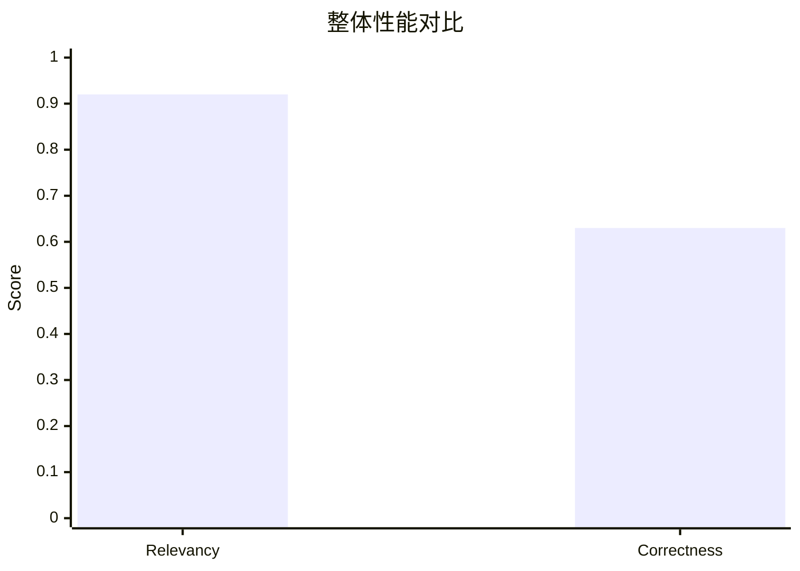
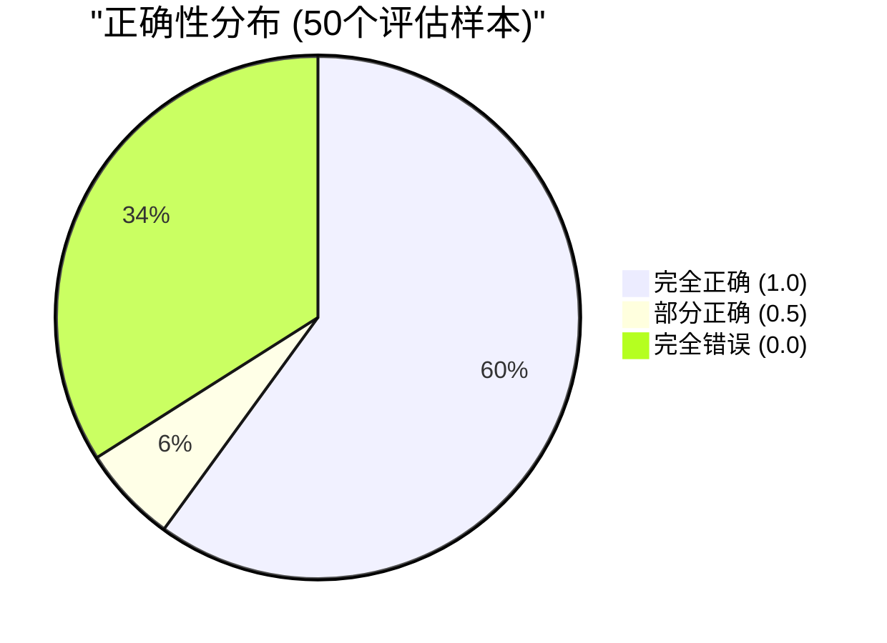
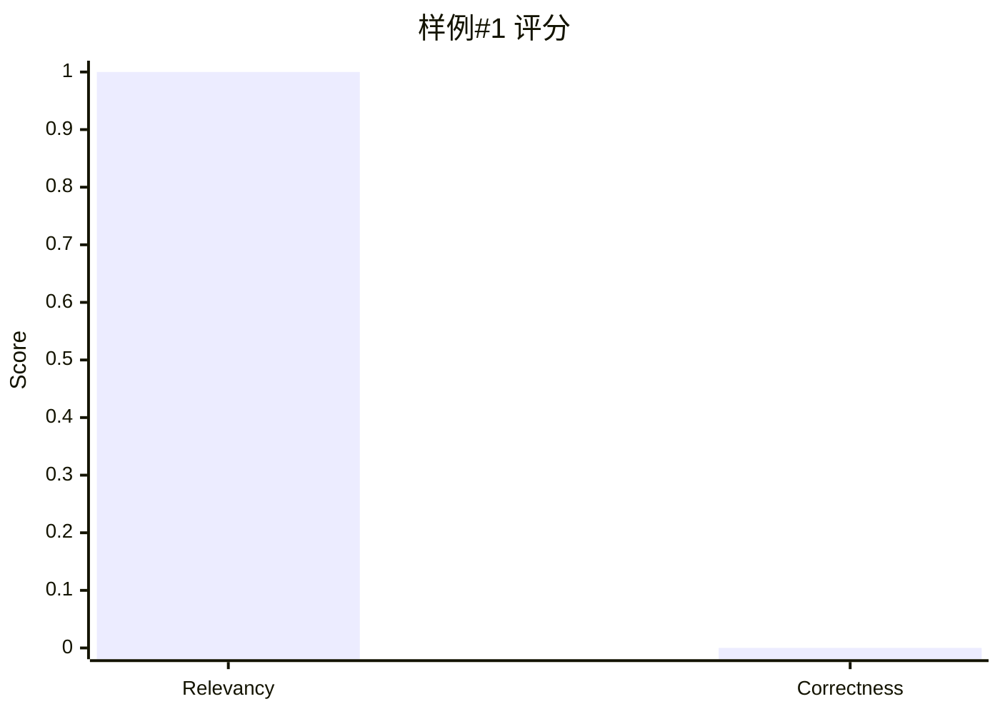
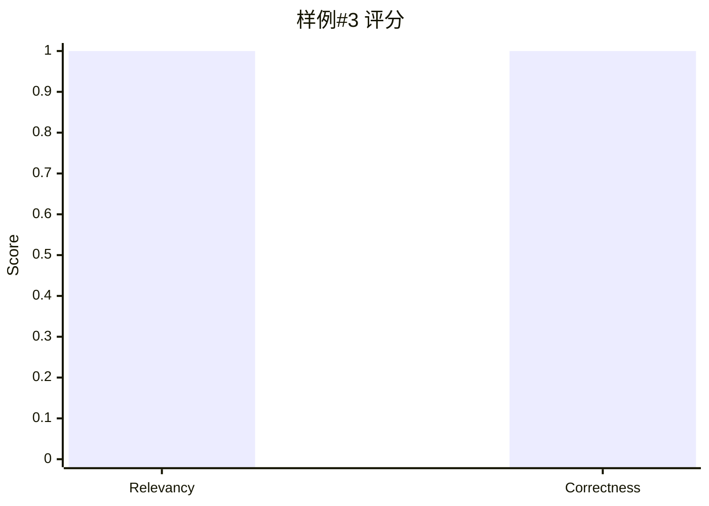
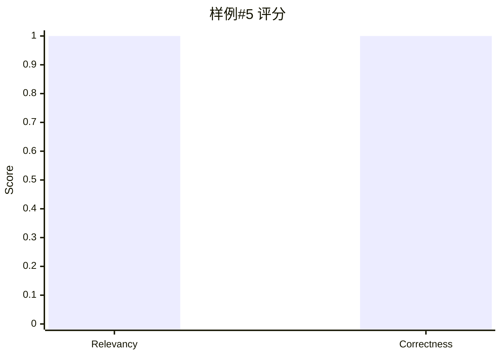
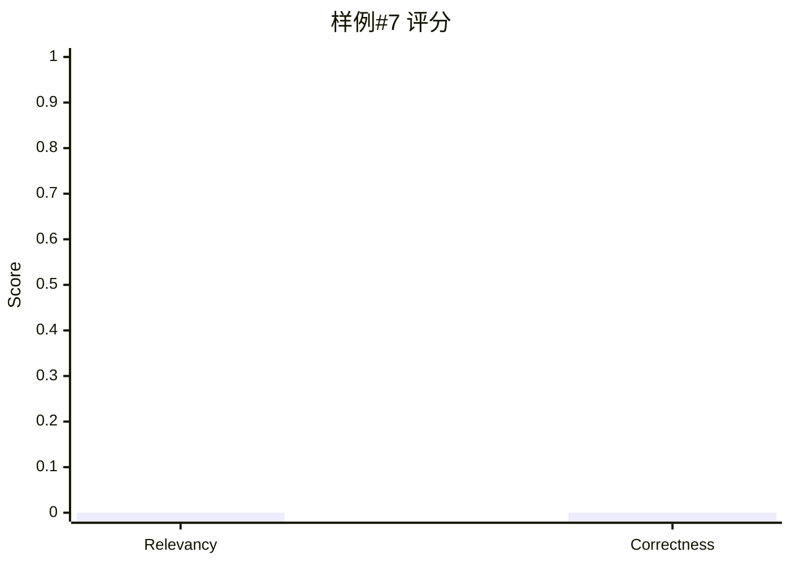
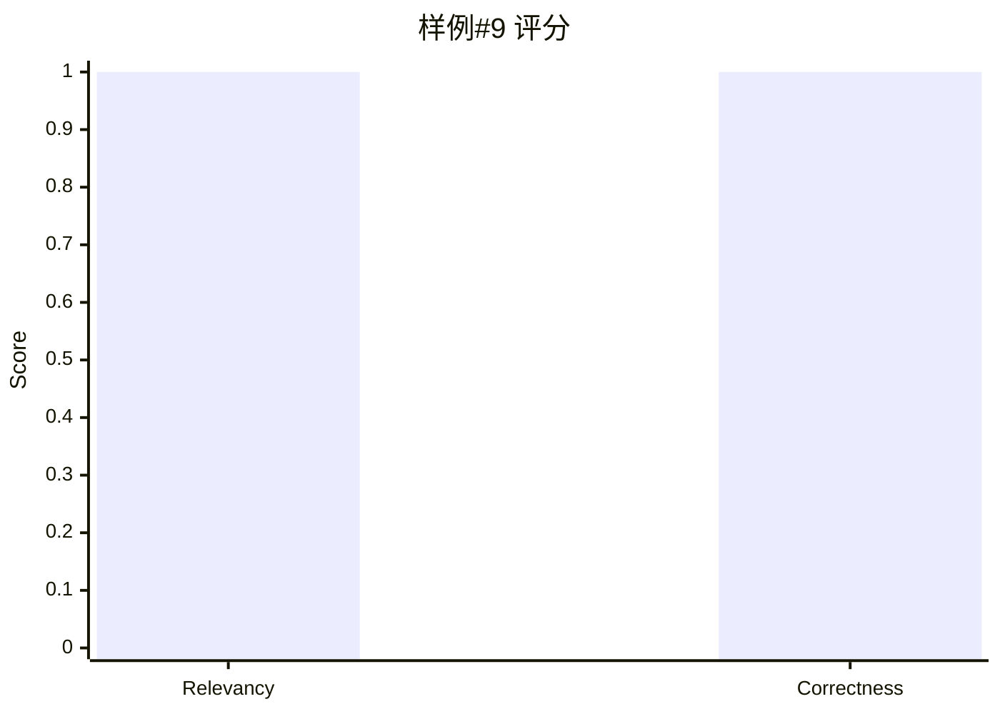
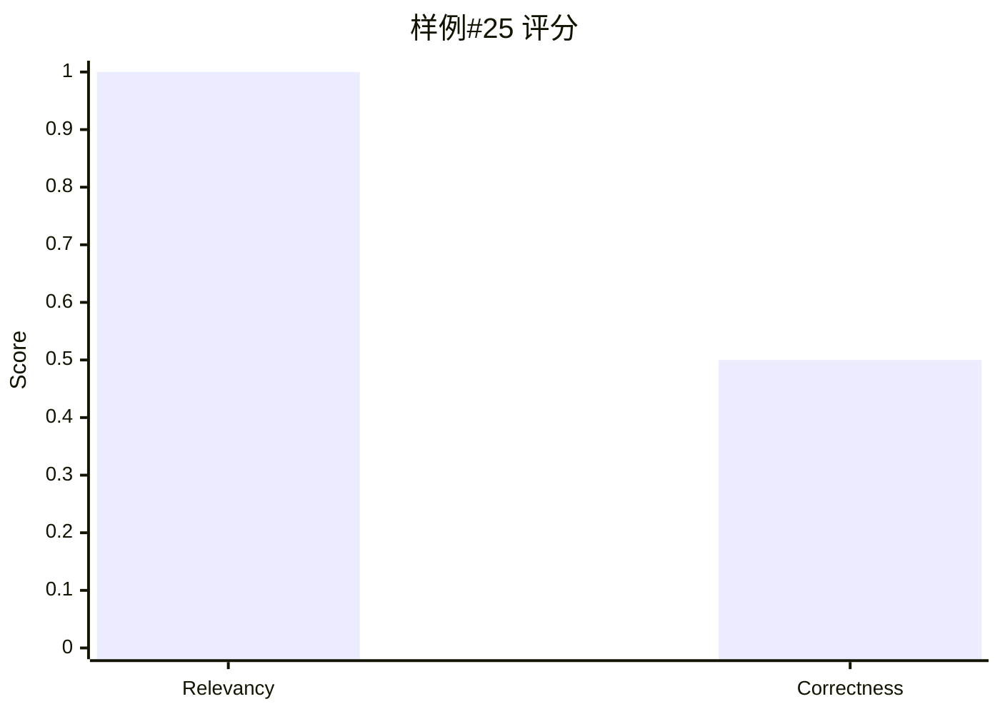

# PopQA (知识问答) - 详细样例分析

## 📊 数据集概览

**数据集名称:** PopQA (知识问答)

**任务描述:** 基于Wikipedia的长尾知识问答任务

**评估样本数:** 50 (索引 0-49)

**本报告样例数:** 15个代表性样例

## 📈 整体性能指标

| 指标 | 分数 | 说明 |
|------|------|------|
| **Relevancy (相关性)** | 0.920 (92.0%) | 检索内容与问题的相关程度 |
| **Correctness (正确性)** | 0.630 (63.0%) | 答案的准确性 |

### 整体得分分布



### 样本质量分布



---

## 📝 详细样例分析

以下15个样例按质量分为三组:
- **高质量样例** (正确性 = 1.0): 5个
- **中等质量样例** (0 < 正确性 < 1.0): 5个
- **低质量样例** (正确性 = 0.0): 5个


---

### 样例 #1 - ❌ 错误

**问题:**
> What is Henry Feilden's occupation?

**真实答案:**
- "politician", "political leader", "political figure", "polit.", "pol"

**检索内容 (Top 3):**

1. **Henry Feilden (Conservative politician)** (相关性得分: 1.6985543)
   ```
    Henry Master Feilden (21 February 1818 – 5 September 1875) was an English Conservative Party politician.
   ```

2. **Feilden** (相关性得分: 1.5850108)
   ```
   Bernard Feilden (1919–2008), British conservation architect ; Bob Feilden (1917–2004), British mechanical engineer ; Gerry Feilden (1904–1981), British general and horse racing identity ; Henry Feilde...
   ```

3. **Feilden baronets** (相关性得分: 1.572508)
   ```
    Henry Wemyss Feilden, second son of the second Baronet, was an Arctic explorer.
   ```

**模型答案:**
```
Henry Feilden is a British Army officer.
```

**评估得分:**
- **Relevancy (相关性)**: 1.00
- **Correctness (正确性)**: 0.00

**分析:** 模型回答错误或不相关

**注意**: 检索到了相关内容但答案错误,可能是答案提取或推理环节出现问题。



---

### 样例 #2 - ✅ 高质量

**问题:**
> What is Herlyn Espinal's occupation?

**真实答案:**
- "journalist", "journo", "journalists"

**检索内容 (Top 3):**

1. **Herlyn Espinal** (相关性得分: 1.8138638)
   ```
    Espinal was born and raised in the Santa Rita district of Yoro. In a 2009 interview he said that from an early age he had aspirations of becoming a journalist. In his youth, Espinal was active in the...
   ```

2. **Herlyn Espinal** (相关性得分: 1.7767518)
   ```
    Herlyn Iván Espinal Martínez (14 September 1982 – 20 July 2014) was a Honduran journalist and television reporter who worked as chief correspondent in San Pedro Sula, the second largest city in Hondu...
   ```

3. **Herlyn Espinal** (相关性得分: 1.6238754)
   ```
    Espinal was found dead on 21 July 2014. He was 31 at the time of his murder. In the aftermath of his murder, contradictory information circulated regarding the last hours of his life and the circumst...
   ```

**模型答案:**
```
Herlyn Espinal was a journalist.
```

**评估得分:**
- **Relevancy (相关性)**: 1.00
- **Correctness (正确性)**: 1.00

**分析:** 模型回答正确且相关


---

### 样例 #3 - ✅ 高质量

**问题:**
> What is Edward Corser's occupation?

**真实答案:**
- "politician", "political leader", "political figure", "polit.", "pol"

**检索内容 (Top 3):**

1. **Edward Corser** (相关性得分: 1.8303025)
   ```
    Corser was born at Upton Cressett, near Birmingham in England, and was educated in Worcester. He migrated to Brisbane, Queensland with his family in 1864 and worked for three years on the Maryborough...
   ```

2. **Edward Corser** (相关性得分: 1.7874286)
   ```
    Edward Bernard Cresset Corser (1852 &ndash; 31 July 1928) was an Australian politician. He was a Liberal Party member of the Queensland Legislative Assembly for Maryborough from 1909 to 1915 and a Co...
   ```

3. **Edward Corser** (相关性得分: 1.7119396)
   ```
    Corser was a co-founder and president of the Maryborough Chamber of Commerce, a long-serving member and nine-year chairman of the Burrum Divisional Board, president of the Maryborough Harbour Board, ...
   ```

**模型答案:**
```
Edward Corser is a politician.
```

**评估得分:**
- **Relevancy (相关性)**: 1.00
- **Correctness (正确性)**: 1.00

**分析:** 模型回答正确且相关




---

### 样例 #4 - ❌ 错误

**问题:**
> What is John Finlay's occupation?

**真实答案:**
- "politician", "political leader", "political figure", "polit.", "pol"

**检索内容 (Top 3):**

1. **John Finlay (footballer)** (相关性得分: 1.6728635)
   ```
    John Finlay (16 February 1919 – 5 March 1985) was an English professional footballer who played as an inside forward for Sunderland. John Finlay made his debut on the 11th of September 1946 as a subs...
   ```

2. **Andrew Finlay** (相关性得分: 1.6535826)
   ```
    Source:
   ```

3. **John Finlay (poet)** (相关性得分: 1.6485124)
   ```
    John Finlay (1782–1810) was a Scottish poet.
   ```

**模型答案:**
```
John Finlay is a retired English professional footballer who played as an inside forward for Sunderland.
```

**评估得分:**
- **Relevancy (相关性)**: 1.00
- **Correctness (正确性)**: 0.00

**分析:** 模型回答错误或不相关

**注意**: 检索到了相关内容但答案错误,可能是答案提取或推理环节出现问题。


---

### 样例 #5 - ✅ 高质量

**问题:**
> What is Bruce McDaniel's occupation?

**真实答案:**
- "composer"

**检索内容 (Top 3):**

1. **Bruce McDaniel** (相关性得分: 1.7091708)
   ```
     Bruce McDaniel (born September 23, 1962) is an American musician, composer, producer and recording engineer, currently living in New Orleans. Bruce McDaniel was born in Boston, Massachusetts of Mexi...
   ```

2. **Jerry McDaniel** (相关性得分: 1.5812864)
   ```
    '91" poster. An official AFL-CIO special-run artist-signed copy of this print is in the University of Missouri St. Louis Art Collection – "The Bruce & Barbara Feldacker Labor Art Collection", and the...
   ```

3. **Randall McDaniel** (相关性得分: 1.5408397)
   ```
    Randall Cornell McDaniel (born December 19, 1964) is an American former football player who was a guard in the National Football League (NFL).
   ```

**模型答案:**
```
Bruce McDaniel is a musician, composer, producer, and recording engineer.
```

**评估得分:**
- **Relevancy (相关性)**: 1.00
- **Correctness (正确性)**: 1.00

**分析:** 模型回答正确且相关




---

### 样例 #6 - ✅ 高质量

**问题:**
> What is Edwin Wallock's occupation?

**真实答案:**
- "actor", "actress", "actors", "actresses"

**检索内容 (Top 3):**

1. **Edwin Wallock** (相关性得分: 1.9331672)
   ```
    Edwin Wallock (November 6, 1877 &ndash; February 4, 1951) was an American actor of the silent film era. He appeared in 60 films between 1912 and 1923. He was born in Council Bluffs, Iowa and died in ...
   ```

2. **Ronnie Wallwork** (相关性得分: 1.5390942)
   ```
    Ronald Wallwork (born 10 September 1977) is an English former professional footballer who played as a midfielder. An England under-20 international, he began his career at Manchester United, where he...
   ```

3. **Frank K. Hallock** (相关性得分: 1.5361872)
   ```
    Frank Kirkwood Hallock (August 18, 1860 – April 29, 1937) was an American medical doctor and book collector. He was born in Oyster Bay, Long Island, on August 18, 1860. Hallock received a Bachelor of...
   ```

**模型答案:**
```
Edwin Wallock was an actor in the silent film era.
```

**评估得分:**
- **Relevancy (相关性)**: 1.00
- **Correctness (正确性)**: 1.00

**分析:** 模型回答正确且相关


---

### 样例 #7 - ❌ 错误

**问题:**
> What is Matthew McKay's occupation?

**真实答案:**
- "dentist", "dentists", "dental surgeon"

**检索内容 (Top 3):**

1. **Matthew McKay (politician)** (相关性得分: 1.6476088)
   ```
    Matthew McKay (6 October 1858 – 14 February 1937) was a Liberal party member of the House of Commons of Canada. He was born in West Gwillimbury Township, Ontario and became a dentist, dental surgeon ...
   ```

2. **Matt McKay (English footballer)** (相关性得分: 1.6228268)
   ```
    Matt McKay (born 21 January 1981) is an English footballer who played as a midfielder in the Football League for Chester City. McKay joined Everton from Chester on transfer deadline day on 26 March 1...
   ```

3. **Adam McKay** (相关性得分: 1.572121)
   ```
   Acting roles 
   ```

**模型答案:**
```
Matthew McKay is a professional footballer who plays as a midfielder for Everton in the Premier League.
```

**评估得分:**
- **Relevancy (相关性)**: 0.00
- **Correctness (正确性)**: 0.00

**分析:** 模型回答错误或不相关




---

### 样例 #8 - ✅ 高质量

**问题:**
> What is Dominick Bellizzi's occupation?

**真实答案:**
- "jockey"

**检索内容 (Top 3):**

1. **Dominick Bellizzi** (相关性得分: 1.6386243)
   ```
    Dominick Bellizzi (c. 1912 – 17 May 1934) was an American jockey who died at age 21 as a result of a horse racing accident. He was known as "The Duke". Bellizzi was born in New York to Albanian immig...
   ```

2. **Dominic A. Cariello** (相关性得分: 1.5080992)
   ```
    Cariello obtained a B.S. in Mechanical Engineering from the University of Wisconsin-Parkside in 1992. As a civilian he works at a paving and construction manufacturer in Racine, Wisconsin.
   ```

3. **Bellizzi (surname)** (相关性得分: 1.4930758)
   ```
   Domenico Bellizzi (1918–1989), Albanian poet ; Dominick Bellizzi (c. undefined 1912–1934), American jockey ; Mario Bellizzi (born 1957), Italian poet Bellizzi is a surname. Notable people with the sur...
   ```

**模型答案:**
```
Jockey.
```

**评估得分:**
- **Relevancy (相关性)**: 1.00
- **Correctness (正确性)**: 1.00

**分析:** 模型回答正确且相关


---

### 样例 #9 - ✅ 高质量

**问题:**
> What is Ole Krarup's occupation?

**真实答案:**
- "politician", "political leader", "political figure", "polit.", "pol"

**检索内容 (Top 3):**

1. **Ole Krarup** (相关性得分: 2.1450615)
   ```
    Ole Krarup (17 March 1935 &ndash; 7 October 2017) was a Danish EU politician and former professor of law at the University of Copenhagen.
   ```

2. **Ole Krarup** (相关性得分: 2.1211822)
   ```
    Krarup died on 7 October 2017 at the age of 82.
   ```

3. **Ole Krarup** (相关性得分: 1.8858776)
   ```
    From 1994 through 2006 he was Member of the European Parliament with the Folkebevægelsen mod EU (People's Movement against the EU), Member of the Bureau of the European United Left - Nordic Green Lef...
   ```

**模型答案:**
```
Ole Krarup was a Danish politician and former professor of law at the University of Copenhagen.
```

**评估得分:**
- **Relevancy (相关性)**: 1.00
- **Correctness (正确性)**: 1.00

**分析:** 模型回答正确且相关




---

### 样例 #12 - ❌ 错误

**问题:**
> What is Derek Wheatley's occupation?

**真实答案:**
- "novelist", "barrister", "barrister-at-law", "Bar-at-law"

**检索内容 (Top 3):**

1. **Derek Wheatley** (相关性得分: 1.7449834)
   ```
    Derek Peter Francis Wheatley QC (died 23 September 2018) was an English barrister, legal advisor and novelist. Wheatley was educated at University College, Oxford, going up to Oxford in 1944. He beca...
   ```

2. **Kevin Wheatley** (相关性得分: 1.5547738)
   ```
    Wheatley was born in the Sydney suburb of Surry Hills on 13 March 1937, the third child of Raymond and Ivy (née Newman) Wheatley, both natives of Sydney. He was educated at Maroubra Junction Junior T...
   ```

3. **Ron Wheatley** (相关性得分: 1.5434202)
   ```
    Roland Wheatley (20 June 1924 – 27 July 2003) was an English professional footballer who played as a wing half.
   ```

**模型答案:**
```
Derek Wheatley is a barrister.
```

**评估得分:**
- **Relevancy (相关性)**: 1.00
- **Correctness (正确性)**: 0.00

**分析:** 模型回答错误或不相关

**注意**: 检索到了相关内容但答案错误,可能是答案提取或推理环节出现问题。


---

### 样例 #14 - ⚠️ 部分正确

**问题:**
> What is Modou Dia's occupation?

**真实答案:**
- "diplomat", "politician", "political leader", "political figure", "polit.", "pol"

**检索内容 (Top 3):**

1. **Modou Dia** (相关性得分: 1.7689778)
   ```
    Modou Dia (born 27 March 1950) is a Senegalese politician and former diplomat. Dia represented Senegal in Saudi Arabia, the Soviet Union, West Germany and Austria. He also was the Senegalese permanen...
   ```

2. **Modou Jobe** (相关性得分: 1.6850992)
   ```
    Born in Sanyang, he has played club football for Real de Banjul, Niarry Tally, Linguère and El-Kanemi Warriors. He re-joined Linguère in October 2017 for pre-season training, before signing for Niger...
   ```

3. **Modou Diagne** (相关性得分: 1.6354527)
   ```
    Modou Diagne (born 3 January 1994) is a Senegalese professional footballer who plays for Cypriot club Olympiakos Nicosia. As a youth, he was capped for the France U20 team, but switched to Senegal U2...
   ```

**模型答案:**
```
Modou Dia is a politician and former diplomat.
```

**评估得分:**
- **Relevancy (相关性)**: 1.00
- **Correctness (正确性)**: 0.50

**分析:** 模型回答部分正确或不够精确


---

### 样例 #18 - ❌ 错误

**问题:**
> What is Russell Stokes's occupation?

**真实答案:**
- "politician", "political leader", "political figure", "polit.", "pol"

**检索内容 (Top 3):**

1. **Russell Stokes** (相关性得分: 1.6459734)
   ```
    Russell Newton Stokes (26 August 1903 &ndash; 6 July 1974) was an Australian politician. Born in Ivanhoe to manufacturer Henry Richmond Stokes and Emma Rowdon Wippell. He attended Melbourne Grammar S...
   ```

2. **Marcus Stokes** (相关性得分: 1.4599125)
   ```
    Before his career in films, Marcus worked in Architectural design and holds a master's degree from the University of California, Berkeley. Marcus also worked in rural Japan as a language instructor a...
   ```

3. **Rob Stokes** (相关性得分: 1.4007319)
   ```
    Robert Gordon Stokes (born 17 January 1975), an Australian politician, is the New South Wales Minister for Planning and Public Spaces in the second Berejiklian ministry since April 2019. He is a memb...
   ```

**模型答案:**
```
Russell Stokes is a fictional character from the CBS crime drama "CSI: Crime Scene Investigation," portrayed by George Eads.
```

**评估得分:**
- **Relevancy (相关性)**: 1.00
- **Correctness (正确性)**: 0.00

**分析:** 模型回答错误或不相关

**注意**: 检索到了相关内容但答案错误,可能是答案提取或推理环节出现问题。


---

### 样例 #25 - ⚠️ 部分正确

**问题:**
> What is Kazuyoshi Sekine's occupation?

**真实答案:**
- "playwright", "dramatist", "playwrite", "scriptwriter"

**检索内容 (Top 3):**

1. **Kazuyoshi Sekine** (相关性得分: 1.6800501)
   ```
    Kazuyoshi Sekine (関根和美 Sekine Kazuyoshi), also known as Kazumi Sekine, is a Japanese film director, a dramatist, and a movie producer and the president of Sekine Production production company (関根プロ)....
   ```

2. **Gen Sekine** (相关性得分: 1.5239501)
   ```
    Endo was the leader of an Inagawa-kai-affiliated criminal group who acted as the supervisor of Sekine, who was also a customer of the Africa Kennel. Following Kawasaki's disappearance, he attended a ...
   ```

3. **Ryuichi Sekine** (相关性得分: 1.5015919)
   ```
    Ryuichi Sekine (関根龍一) is a Japanese professional wrestler, currently working as a freelancer and is best known for his time in the professional wrestling promotion Kaientai Dojo.
   ```

**模型答案:**
```
Kazuyoshi Sekine is a Japanese film director, dramatist, and movie producer.
```

**评估得分:**
- **Relevancy (相关性)**: 1.00
- **Correctness (正确性)**: 0.50

**分析:** 模型回答部分正确或不够精确




---

### 样例 #27 - ❌ 错误

**问题:**
> What is Charles Harrison's occupation?

**真实答案:**
- "politician", "political leader", "political figure", "polit.", "pol"

**检索内容 (Top 3):**

1. **Charles &quot;Chuck&quot; Harrison** (相关性得分: 1.7409818)
   ```
    Charles "Chuck" Harrison (September 23, 1931 — November 29, 2018) was an American industrial designer, speaker and educator. He was known for his pioneering role as one of the first African-American ...
   ```

2. **Charles &quot;Chuck&quot; Harrison** (相关性得分: 1.7342861)
   ```
    Between his undergraduate and graduate degrees, Harrison was drafted into the United States Army and posted to Germany. He served two years in the topography unit doing spot mapping and drafting. Get...
   ```

3. **Charles &quot;Chuck&quot; Harrison** (相关性得分: 1.720463)
   ```
    the elder Mr. Harrison taught shop at the Phoenix Union Colored High School, from which Charles graduated in 1948. He briefly attended the City College of San Francisco, where he was told his future ...
   ```

**模型答案:**
```
Charles Harrison is an industrial designer.
```

**评估得分:**
- **Relevancy (相关性)**: 1.00
- **Correctness (正确性)**: 0.00

**分析:** 模型回答错误或不相关

**注意**: 检索到了相关内容但答案错误,可能是答案提取或推理环节出现问题。


---

### 样例 #39 - ⚠️ 部分正确

**问题:**
> What is Adil Shamoo's occupation?

**真实答案:**
- "biochemist", "biological chemist"

**检索内容 (Top 3):**

1. **Adil Abdel Aati** (相关性得分: 1.4366119)
   ```
    Adil Entered elementary, middle and high Schools in Atbara, Sudan. He studied later at the Faculty of Law at Cairo University, Khartoum Branch (Now Neelain University) in Khartoum, Sudan in the years...
   ```

2. **Adil Omar** (相关性得分: 1.4205775)
   ```
    Adil Omar (born 17 May 1991) is a recording artist, rapper, record producer, singer and songwriter from Islamabad, Pakistan. He released his debut album and film, Transcendence, on 8 July 2018. In ad...
   ```

3. **Shamsher-ul-Hyderi** (相关性得分: 1.412755)
   ```
    During his professional career, Shamsher-ul-Hyderi held a variety of jobs. His various employers included: the Pakistan Public Works Department (as clerk), the Cooperative Bank in Badin (as manager),...
   ```

**模型答案:**
```
Adil Shamoo is a professor at the University of Maryland.
```

**评估得分:**
- **Relevancy (相关性)**: 1.00
- **Correctness (正确性)**: 0.50

**分析:** 模型回答部分正确或不够精确


---

## 🎯 样例总结

### 本批次15个样例的表现

| 质量等级 | 数量 | 占比 |
|---------|------|------|
| ✅ 完全正确 | 6 | 40.0% |
| ⚠️ 部分正确 | 3 | 20.0% |
| ❌ 完全错误 | 6 | 40.0% |

### 关键发现


1. **检索表现优秀**: 相关性高达92%,说明检索系统能有效找到相关知识
2. **答案提取需改进**: 正确性仅63%,说明从检索内容中提取精确答案存在困难
3. **常见错误**: 答案不够精确、包含多余信息、或提取了错误的实体

**改进建议:**
- 优化答案提取算法,提高精确度
- 加强答案验证机制
- 改进提示词设计,明确要求简洁答案

---

*报告生成时间: 2025-11-05*
