# Health Claims (健康声明验证) - 详细样例分析

## 📊 数据集概览

**数据集名称:** Health Claims (健康声明验证)

**任务描述:** 健康相关声明的真假判断任务

**评估样本数:** 50 (索引 0-49)

**本报告样例数:** 15个代表性样例

## 📈 整体性能指标

| 指标 | 分数 | 说明 |
|------|------|------|
| **Relevancy (相关性)** | 0.446 (44.6%) | 检索内容与问题的相关程度 |
| **Correctness (正确性)** | 0.700 (70.0%) | 答案的准确性 |

### 整体得分分布

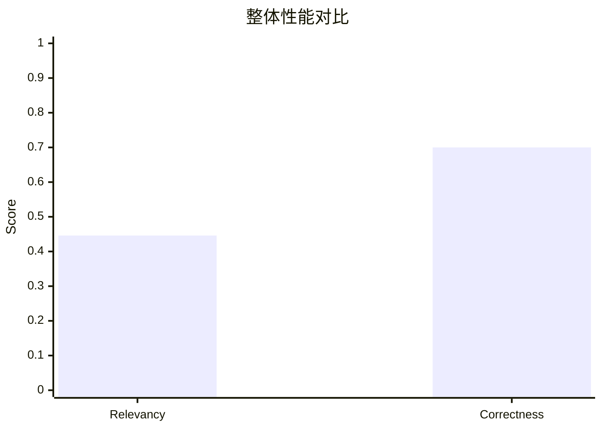

### 样本质量分布

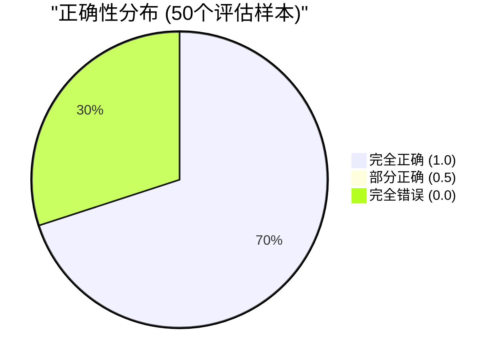

---

## 📝 详细样例分析

以下15个样例按质量分为三组:
- **高质量样例** (正确性 = 1.0): 5个
- **中等质量样例** (0 < 正确性 < 1.0): 5个
- **低质量样例** (正确性 = 0.0): 5个


---

### 样例 #1 - ✅ 判断正确

**健康声明:**
> A mother revealed to her child in a letter after her death that she had just one eye because she had donated the other to him.

**真实标签:** REFUTES (❌ 虚假)

**标准答案:** "false"

**检索内容 (Top 3):**

1. **Kastellorizo** (相关性得分: 1.6861751)
   ```
   crystal carafe with it and brought it to her future mother-in-law, who gave her in return a special cake and an odd number of gold coins. When a child became seriously ill, a woman with knowledge of p...
   ```

2. **Diane Schuur** (相关性得分: 1.5816799)
   ```
   Paulo, Rome, Palermo, Guanajuato, and multiple cities across the United States. Schuur received a financial settlement from her birth hospital for her loss of vision. Prematurity itself is associated ...
   ```

3. **Janis Babson** (相关性得分: 1.5617763)
   ```
   that when she died she wanted to donate her eyes to the Eye Bank. Her parents—Harry Rudolphe (Rudy) Babson, a member of the Royal Canadian Mounted Police and Rita Quinn Babson—knew their daughter was ...
   ```

**模型判断:**
```
false
```

**评估得分:**
- **Relevancy (相关性)**: 0.00
- **Correctness (正确性)**: 1.00

**分析:** 模型正确判断该声明为❌ 虚假

**⚠️ 检索不足**: 检索相关性低,可能缺少关键证据。

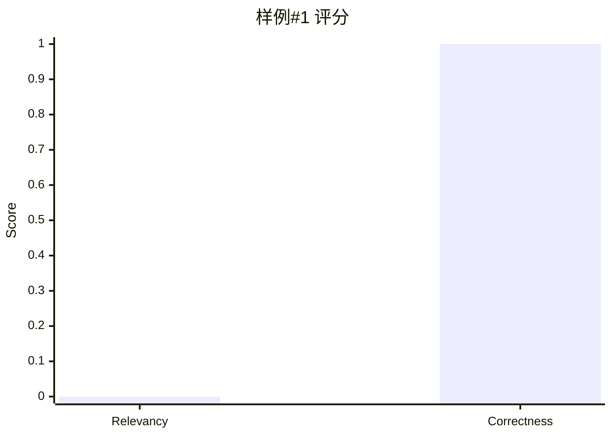

---

### 样例 #2 - ✅ 判断正确

**健康声明:**
> Study says too many Americans still drink too much.

**真实标签:** SUPPORTS (✅ 真实)

**标准答案:** "true"

**检索内容 (Top 3):**

1. **Binge drinking** (相关性得分: 1.5241569)
   ```
   than seven standard drinks per week or three drinks per day. Despite this risk, a 2014 report in the National Survey on Drug Use and Health found that only 10% of either "heavy drinkers" or "binge dri...
   ```

2. **Culture of the United States** (相关性得分: 1.4958608)
   ```
   coffee to tea, and more than half the adult population drinks at least one cup a day. Marketing by U.S. industries is largely responsible for making orange juice and milk (now often fat-reduced) ubiqu...
   ```

3. **Alcoholism** (相关性得分: 1.4896064)
   ```
   exceeds 14 standard drinks per week or 4 drinks per day, and women may be at risk if they have more than 7 standard drinks per week or 3 drinks per day. It defines a standard drink as one 12-ounce bot...
   ```

**模型判断:**
```
true
```

**评估得分:**
- **Relevancy (相关性)**: 0.50
- **Correctness (正确性)**: 1.00

**分析:** 模型正确判断该声明为✅ 真实


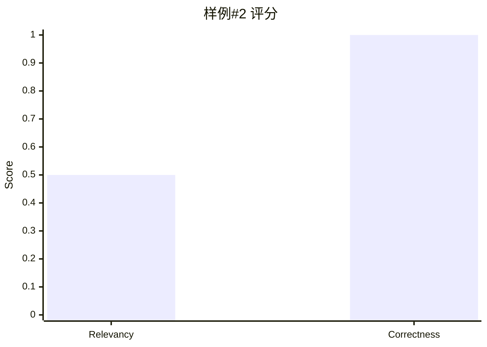

---

### 样例 #3 - ✅ 判断正确

**健康声明:**
> Viral image Says 80% of novel coronavirus cases are "mild.

**真实标签:** SUPPORTS (✅ 真实)

**标准答案:** "true"

**检索内容 (Top 3):**

1. **Coronaviridae** (相关性得分: 1.7580991)
   ```
   Coronaviridae Coronaviridae is a family of enveloped, positive-sense, single-stranded RNA viruses. The viral genome is 26–32 kb in length. Virions are spherical, 120–160 nm across ("Coronavirinae"), b...
   ```

2. **Coronavirus** (相关性得分: 1.7451199)
   ```
   Coronavirus Coronaviruses are species of virus belonging to the subfamily "Coronavirinae" in the family "Coronaviridae", in the order Nidovirales. Coronaviruses are enveloped viruses with a positive-s...
   ```

3. **Coronaviridae** (相关性得分: 1.7429683)
   ```
   selection and packaging is critical for developing antiviral strategies and viral expression vectors based on the coronavirus genome. Coronaviridae Coronaviridae is a family of enveloped, positive-sen...
   ```

**模型判断:**
```
true
```

**评估得分:**
- **Relevancy (相关性)**: 0.50
- **Correctness (正确性)**: 1.00

**分析:** 模型正确判断该声明为✅ 真实


---

### 样例 #4 - ❌ 判断错误

**健康声明:**
> An email says that 9-year old Craig Shergold of Carshalton, Great Britain is dying of Cancer.  As a dying wish, he wants to get into the Guinness Book of World Records by collecting the most greeting cards of anybody in history.  The email asks that the cards be sent to an address of the Make-A-Wish Foundation.  

**真实标签:** REFUTES (❌ 虚假)

**标准答案:** "false"

**检索内容 (Top 3):**

1. **Craig Shergold** (相关性得分: 2.7542267)
   ```
   Craig Shergold Craig Shergold (born 24 June 1979) is a British former cancer patient who received an estimated 350 million greeting cards, earning him a place in the "Guinness Book of World Records". ...
   ```

2. **Craig Shergold** (相关性得分: 2.6206074)
   ```
   began a chain letter campaign requesting individuals to send greeting cards to him with the goal of beating the "Guinness Book of World Records" for 1,000,065 greeting cards received. Craig received g...
   ```

3. **Craig Shergold** (相关性得分: 2.4429207)
   ```
   16,250,692 get-well cards by May 1990, and again in the "1992 Guinness Book of World Records" as having received 33 million cards by May 1991. Craig's cancer worsened. His British doctors estimated he...
   ```

**模型判断:**
```
true
```

**评估得分:**
- **Relevancy (相关性)**: 0.00
- **Correctness (正确性)**: 0.00

**分析:** 模型判断错误,该声明实际为❌ 虚假

**⚠️ 检索不足**: 检索相关性低,可能缺少关键证据。

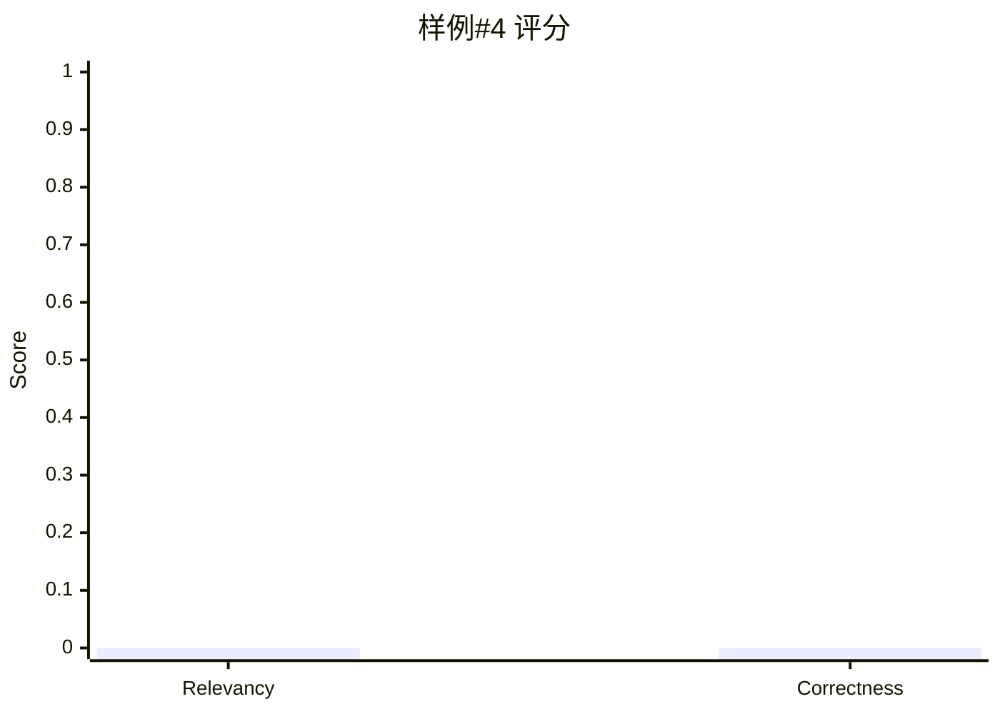

---

### 样例 #5 - ❌ 判断错误

**健康声明:**
> Roche's schizophrenia drug misses goal in two late-stage trials.

**真实标签:** SUPPORTS (✅ 真实)

**标准答案:** "true"

**检索内容 (Top 3):**

1. **Bitopertin** (相关性得分: 1.7677357)
   ```
   66% on placebo (p<0.05, per-protocol population). In January 2014, Roche reported that bitopertin failed to meet its endpoints in two phase III trials assessing its efficacy in reducing negative sympt...
   ```

2. **Tamas Bartfai** (相关性得分: 1.6397983)
   ```
   for 'heartburn', as a consultant to Roche, the catechol-O-methyltransferase inhibitor (Tasmar-tolcapone) used in Parkinson's Disease, the first benzodiazepine–antagonist (flunitrazepam) for treatment ...
   ```

3. **LY-404,039** (相关性得分: 1.6309578)
   ```
   Company announced their decision to stop their ongoing clinical studies investigating LY-2140023 as a treatment for schizophrenia after their phase II study did not meet its primary endpoint. The comp...
   ```

**模型判断:**
```
false
```

**评估得分:**
- **Relevancy (相关性)**: 0.00
- **Correctness (正确性)**: 0.00

**分析:** 模型判断错误,该声明实际为✅ 真实

**⚠️ 检索不足**: 检索相关性低,可能缺少关键证据。


---

### 样例 #10 - ✅ 判断正确

**健康声明:**
> The mayonnaise oozing from a chicken sandwich turned out to be pus from a tumor in the chicken.

**真实标签:** REFUTES (❌ 虚假)

**标准答案:** "false"

**检索内容 (Top 3):**

1. **Nestlé Purina PetCare** (相关性得分: 1.6311157)
   ```
   of one bag that was found to contain salmonella. In 2012 a consumer sued Nestlé Purina Petcare when his pet died after eating Waggin' Train treats. The Food and Drug Administration received more than ...
   ```

2. **Loch Maree Hotel botulism poisoning** (相关性得分: 1.5678952)
   ```
   tongue. Other sandwiches were also made from ingredients including beef, ham, jam and eggs. Investigators obtained the little that remained of the left-over food from the hospital rubbish. Botulinum t...
   ```

3. **Mayonnaise** (相关性得分: 1.5577354)
   ```
   ill and nine died in a New York City hospital due to hospital-prepared mayonnaise. In all salmonellosis cases, the major reason was improper acidification of the mayonnaise, with a pH higher than the ...
   ```

**模型判断:**
```
false
```

**评估得分:**
- **Relevancy (相关性)**: 1.00
- **Correctness (正确性)**: 1.00

**分析:** 模型正确判断该声明为❌ 虚假


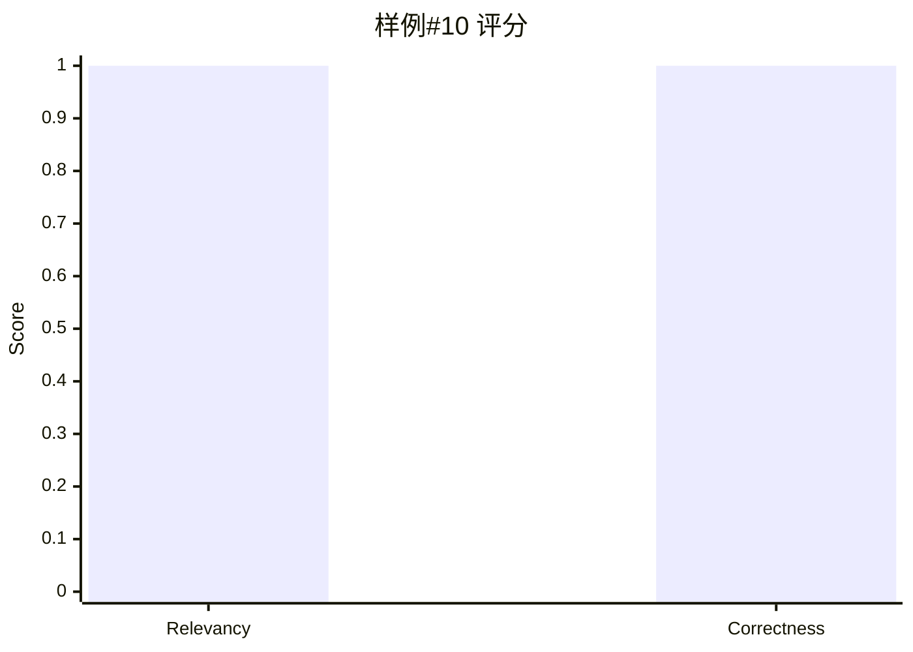

---

### 样例 #16 - ✅ 判断正确

**健康声明:**
> Queen Elizabeth II wore a Burmese Ruby Tiara as a slight against U.S. President Donald Trump.

**真实标签:** REFUTES (❌ 虚假)

**标准答案:** "false"

**检索内容 (Top 3):**

1. **Elizabeth II's jewels** (相关性得分: 1.7043153)
   ```
   her collection to support her exiled family and various charities. Queen Mary had the tiara altered to accommodate 15 of the Cambridge cabochon emeralds. The original drop pearls can easily be replace...
   ```

2. **Elizabeth II's jewels** (相关性得分: 1.699393)
   ```
   in 1973, and it was made by Garrard & Co. using stones from her private collection. It is designed in the form of a wreath of roses, with silver and diamonds making the petals, and clusters of gold an...
   ```

3. **Elizabeth II's jewels** (相关性得分: 1.6748688)
   ```
   Princess of Wales, as a wedding present. She wore it often, notably with her 'Elvis dress' on a visit to Hong Kong in 1989, but on her divorce from Prince Charles it was returned to the Queen. In 2015...
   ```

**模型判断:**
```
false
```

**评估得分:**
- **Relevancy (相关性)**: 1.00
- **Correctness (正确性)**: 1.00

**分析:** 模型正确判断该声明为❌ 虚假


---

### 样例 #25 - ✅ 判断正确

**健康声明:**
> Obamacare "cuts seniors’ Medicare.

**真实标签:** REFUTES (❌ 虚假)

**标准答案:** "false"

**检索内容 (Top 3):**

1. **David McKinley** (相关性得分: 1.5537996)
   ```
   He explained "As it relates to the Medicare, I applaud what Paul Ryan was trying to do, because we need to have an adult conversation about it. The Congressional Budget Office determined that some of ...
   ```

2. **Protecting Access to Medicare Act of 2014** (相关性得分: 1.5265634)
   ```
   Nancy Pelosi said that she supported the bill because she thought Republicans would use the situation, if the Medicare cuts went into effect, to attack Obamacare and because she didn't want seniors to...
   ```

3. **Deficit reduction in the United States** (相关性得分: 1.5201468)
   ```
   in 2012 to 5.4% GDP in 2022 and 6.2% GDP in 2037 and stabilize around that level. However, CBO projects that combined Medicare and Medicaid spending will rise from 5.4% GDP in 2012 to 7.5% GDP by 2022...
   ```

**模型判断:**
```
false
```

**评估得分:**
- **Relevancy (相关性)**: 1.00
- **Correctness (正确性)**: 1.00

**分析:** 模型正确判断该声明为❌ 虚假


---

### 样例 #27 - ❌ 判断错误

**健康声明:**
> Treating First Time Shoulder Dislocations with Surgery Can Benefit Young Athletes, Study Shows

**真实标签:** REFUTES (❌ 虚假)

**标准答案:** "false"

**检索内容 (Top 3):**

1. **Dislocated shoulder** (相关性得分: 1.6746705)
   ```
   faster. If a shoulder cannot be relocated in the emergency room, relocation in the operating room may be required. This situation occurs in about 7% of cases. There does not appear to be any differenc...
   ```

2. **Dislocated shoulder** (相关性得分: 1.652292)
   ```
   rotation, scapular manipulation, and the Stimson technique. After reduction X-rays are recommended for verification. The arm may than be placed in a sling for a few weeks. Surgery may be recommended i...
   ```

3. **Shoulder problem** (相关性得分: 1.5989652)
   ```
   to reinjury, especially in young, active individuals. Ligaments are stretched and may tear due to dislocation. Torn ligaments and other problems resulting from dislocation can increase the chance of r...
   ```

**模型判断:**
```
true
```

**评估得分:**
- **Relevancy (相关性)**: 0.80
- **Correctness (正确性)**: 0.00

**分析:** 模型判断错误,该声明实际为❌ 虚假

**⚠️ 推理错误**: 检索到相关证据但判断错误,可能是推理逻辑问题。

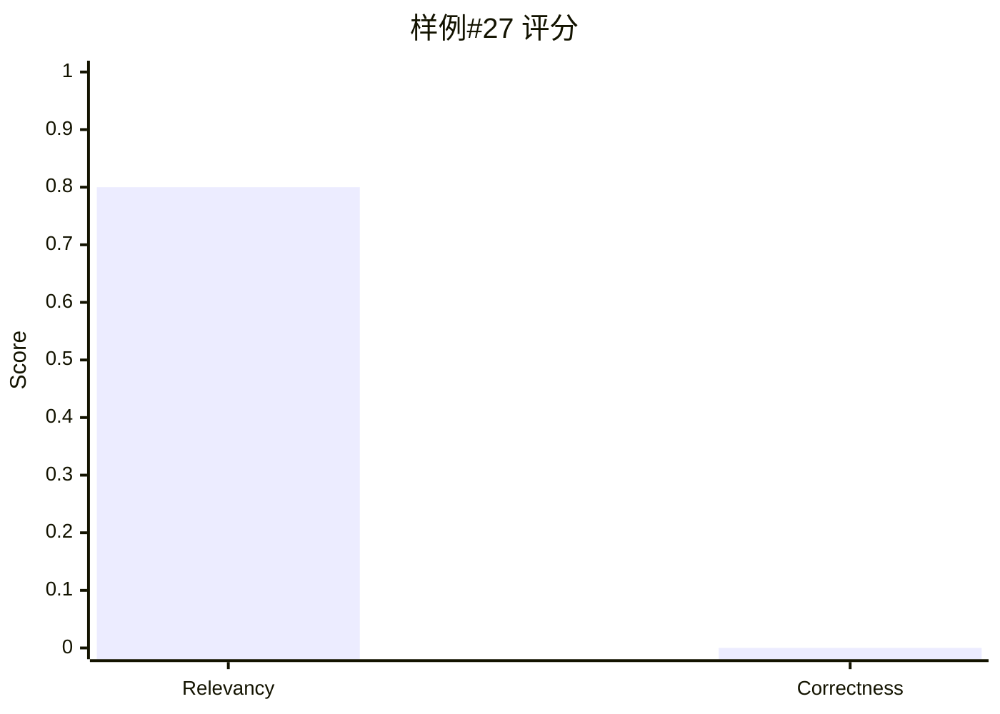

---

### 样例 #36 - ✅ 判断正确

**健康声明:**
>  A forwarded email that blames President Obama   for delays in the rescue of Richard Phillips, the captain of the ship   named the Maersk Alabama, which was taken over by pirates off the coast   of the African country of Somalia. It claims that Obama delayed the   deployment of Navy Seals by 36 hours and limited the rules of engagement   so the rescuers could not act unless Captain Phillips’ life was imminent   danger.      

**真实标签:** REFUTES (❌ 虚假)

**标准答案:** "false"

**检索内容 (Top 3):**

1. **Richard Phillips (merchant mariner)** (相关性得分: 2.5590754)
   ```
   of the port of Mombasa. On Saturday, April 11, "Maersk Alabama" arrived in Mombasa, still under U.S. military escort. Captain Larry Aasheim then assumed command. Aasheim had previously been captain of...
   ```

2. **Richard Phillips (merchant mariner)** (相关性得分: 2.491821)
   ```
   "Bainbridge" and speaking with military negotiators while being treated for an injury sustained in the takeover of "Maersk Alabama", surrendered and was taken into custody. He later pleaded guilty to ...
   ```

3. **MV Tygra** (相关性得分: 2.4744456)
   ```
   pirate, whom they had kept tied up for twelve hours, for Captain Phillips. The captured pirate was released but the pirates refused to release Phillips in exchange. Since the battery had died on the o...
   ```

**模型判断:**
```
false
```

**评估得分:**
- **Relevancy (相关性)**: 1.00
- **Correctness (正确性)**: 1.00

**分析:** 模型正确判断该声明为❌ 虚假


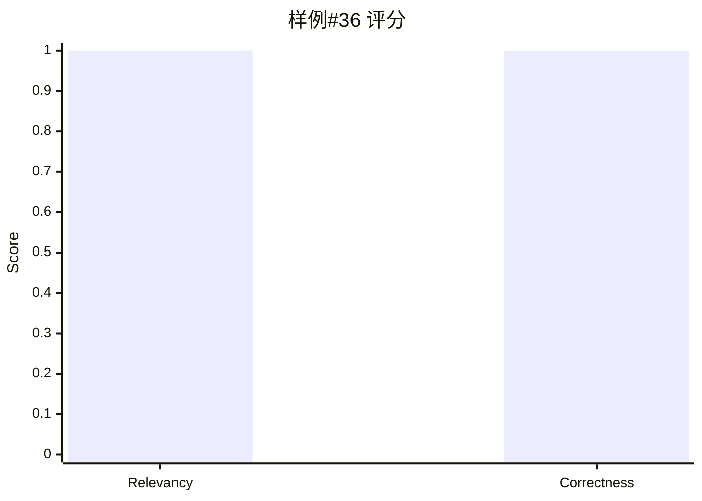

---

### 样例 #37 - ❌ 判断错误

**健康声明:**
> A Time magazine cover from 1977 with the title “The Big Freeze” is an example of media fearmongering over  “global cooling” in the 1970s.

**真实标签:** REFUTES (❌ 虚假)

**标准答案:** "false"

**检索内容 (Top 3):**

1. **Global cooling** (相关性得分: 1.965848)
   ```
   article by David Rose, showing this same cover image, to support his claim that there was as much concern in the 1970s about a "looming 'ice age'" as there was now about global warming. After research...
   ```

2. **Global cooling** (相关性得分: 1.8384103)
   ```
   cooling which did not materialise, therefore there is no need to heed current scientific concerns about climate change. In a 1998 article promoting the Oregon Petition, Fred Singer argued that expert ...
   ```

3. **George Kukla** (相关性得分: 1.814327)
   ```
   highlighted the dangers of global cooling in Science magazine and, to President Richard Nixon. The Nixon administration reacted swiftly to their letter, which described calamities such as killer frost...
   ```

**模型判断:**
```
true
```

**评估得分:**
- **Relevancy (相关性)**: 1.00
- **Correctness (正确性)**: 0.00

**分析:** 模型判断错误,该声明实际为❌ 虚假

**⚠️ 推理错误**: 检索到相关证据但判断错误,可能是推理逻辑问题。

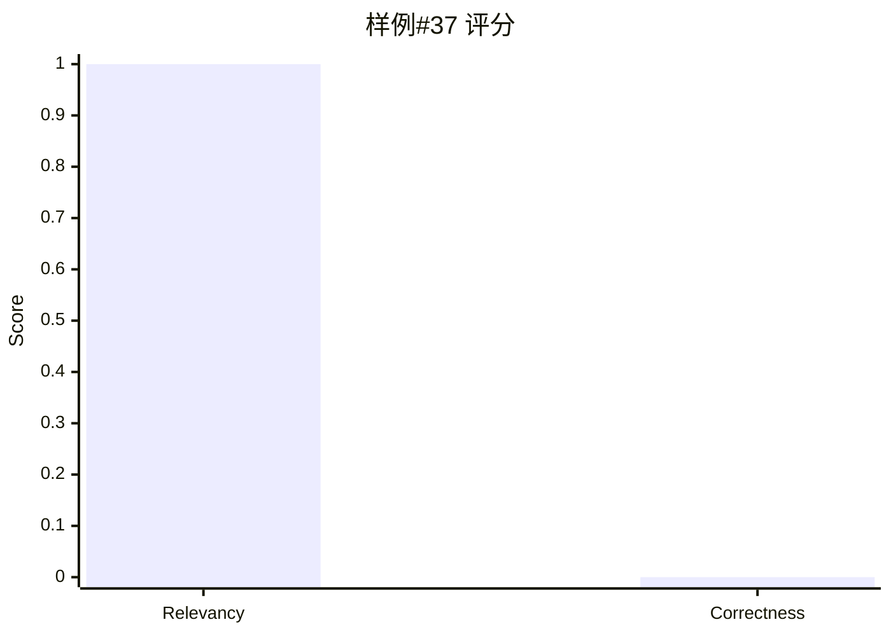

---

### 样例 #41 - ✅ 判断正确

**健康声明:**
> Accepting a friend request from a stranger will provide hackers with access to your computer and online accounts.

**真实标签:** REFUTES (❌ 虚假)

**标准答案:** "false"

**检索内容 (Top 3):**

1. **Privacy concerns with social networking services** (相关性得分: 1.7403054)
   ```
   case these devices are stolen. Install Anti-virus software. Others would be able to use viruses and other ways to invade a user's computer if he or she installed something unsafe. The users' privacy m...
   ```

2. **Online uncovering in Hong Kong** (相关性得分: 1.672629)
   ```
   methods. Most cases are attributed to the victims’ mismanagement of personal information online. Hackers will utilize engines such as Google to uncover the personal information through blogs, social n...
   ```

3. **Privacy concerns with social networking services** (相关性得分: 1.6382489)
   ```
   the necessary antivirus and anti spyware programs to defend against breaches of private information via the internet. Always log out. It is dangerous to keep your device logged on since others may hav...
   ```

**模型判断:**
```
false
```

**评估得分:**
- **Relevancy (相关性)**: 1.00
- **Correctness (正确性)**: 1.00

**分析:** 模型正确判断该声明为❌ 虚假


---

### 样例 #44 - ❌ 判断错误

**健康声明:**
> Suzanne Somers advocates ‘natural’ approach when treating menopause

**真实标签:** REFUTES (❌ 虚假)

**标准答案:** "false"

**检索内容 (Top 3):**

1. **How to Live Forever** (相关性得分: 1.6551293)
   ```
   2008, and has a star on the Hollywood Walk of Fame. In the documentary, Suzanne Somers speaks to the International Congress on Anti-Aging Medicine in Las Vegas. She describes the array of hormones tha...
   ```

2. **Bioidentical hormone replacement therapy** (相关性得分: 1.614869)
   ```
   been made for the efficacy of bioidentical hormones and compounded BHT, with varying evidence to support or contradict them: In 2006, actress Suzanne Somers released the book "Ageless: The Naked Truth...
   ```

3. **Menopause** (相关性得分: 1.5836763)
   ```
   natural stage of life. It is not a disease or a disorder. Therefore, it does not automatically require any kind of medical treatment. However, in those cases where the physical, mental, and emotional ...
   ```

**模型判断:**
```
true
```

**评估得分:**
- **Relevancy (相关性)**: 0.90
- **Correctness (正确性)**: 0.00

**分析:** 模型判断错误,该声明实际为❌ 虚假

**⚠️ 推理错误**: 检索到相关证据但判断错误,可能是推理逻辑问题。

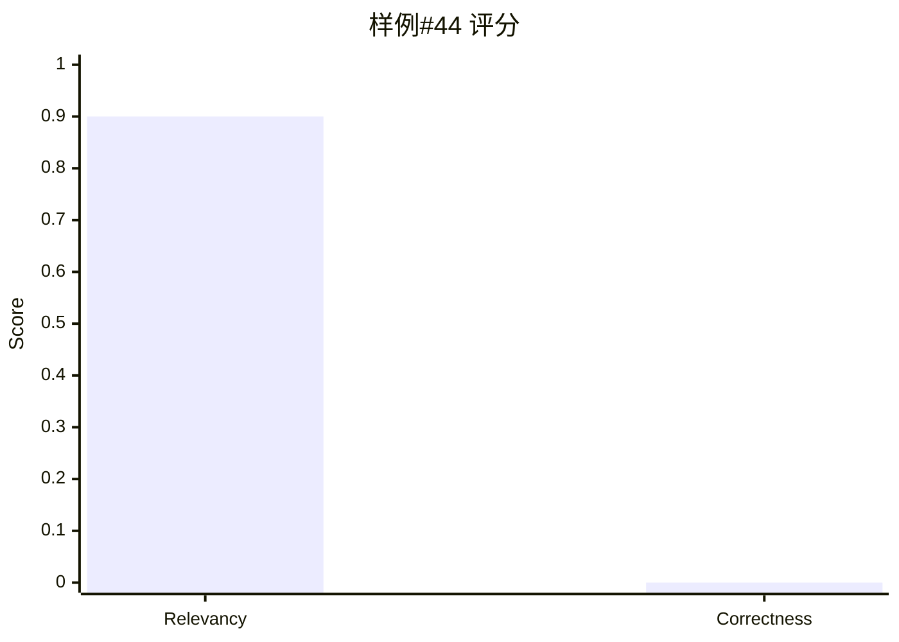

---

### 样例 #47 - ❌ 判断错误

**健康声明:**
> One in 10 babies born in this country is born in Texas.

**真实标签:** SUPPORTS (✅ 真实)

**标准答案:** "true"

**检索内容 (Top 3):**

1. **Texas** (相关性得分: 1.5964017)
   ```
   mortality rate in the developed world, and the rate by which Texas women died from pregnancy related complications doubled from 2010 to 2014, to 23.8 per 100,000. A rate unmatched in any other U.S. st...
   ```

2. **Texas** (相关性得分: 1.5003552)
   ```
   American population is in Austin, Corpus Christi, San Antonio, and the Sharyland area next McAllen, Texas. Three federally recognized Native American tribes reside in Texas: the Alabama-Coushatta Trib...
   ```

3. **Texas** (相关性得分: 1.4959697)
   ```
   population growth by 20.6 percent, but Hispanics growth by 65 percent, whereas non-Hispanic whites only grew by 4.2 percent. Texas has the fifth highest rate of teenage births in the nation and a plur...
   ```

**模型判断:**
```
false
```

**评估得分:**
- **Relevancy (相关性)**: 0.90
- **Correctness (正确性)**: 0.00

**分析:** 模型判断错误,该声明实际为✅ 真实

**⚠️ 推理错误**: 检索到相关证据但判断错误,可能是推理逻辑问题。

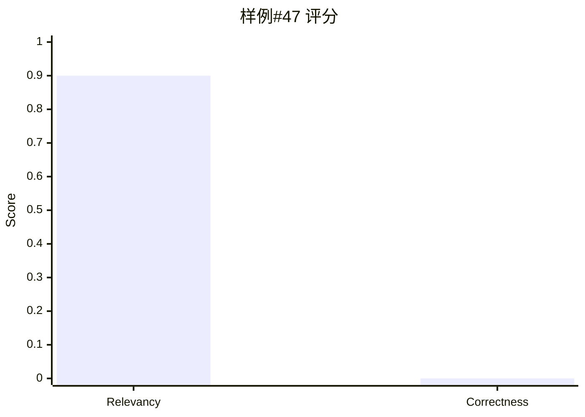

---

### 样例 #49 - ❌ 判断错误

**健康声明:**
> Page 92 of the House health care bill "says specifically that people can't purchase private health insurance after a date certain.

**真实标签:** REFUTES (❌ 虚假)

**标准答案:** "false"

**检索内容 (Top 3):**

1. **Andy Harris (politician)** (相关性得分: 1.6107892)
   ```
   plan would leave the new congressmen and their staffers without coverage until the following pay period, 28 days after inauguration. Concerned about this gap in coverage, he asked whether new governme...
   ```

2. **Bipartisan Health Care Stabilization Act of 2017** (相关性得分: 1.5970588)
   ```
   under 30 to purchase catastrophic health insurance plans, often called 'copper' plans for their low actuarial value. The bill quickly received 24 bipartisan cosponsors, including Sen. Susan Collins (R...
   ```

3. **American Health Care Reform Act of 2013** (相关性得分: 1.5895514)
   ```
   the bill say it allows individuals to decide what they want their health insurance to cover, instead of the government mandating what must be covered by insurance plans. “If sex changes operations are...
   ```

**模型判断:**
```
true
```

**评估得分:**
- **Relevancy (相关性)**: 1.00
- **Correctness (正确性)**: 0.00

**分析:** 模型判断错误,该声明实际为❌ 虚假

**⚠️ 推理错误**: 检索到相关证据但判断错误,可能是推理逻辑问题。


---

## 🎯 样例总结

### 本批次15个样例的表现

| 质量等级 | 数量 | 占比 |
|---------|------|------|
| ✅ 完全正确 | 8 | 53.3% |
| ⚠️ 部分正确 | 0 | 0.0% |
| ❌ 完全错误 | 7 | 46.7% |

### 关键发现


1. **检索质量不稳定**: 相关性44.6%,在不同样本间差异较大
2. **判断准确率良好**: 正确率70%,说明模型有一定事实核查能力
3. **检索起辅助作用**: 检索内容对判断有帮助但非决定性

**改进建议:**
- 增强医学健康领域的检索语料
- 实施多文档交叉验证机制
- 优化查询构建,提高检索召回率
- 加入事实核查专用模块

---

*报告生成时间: 2025-11-05*
