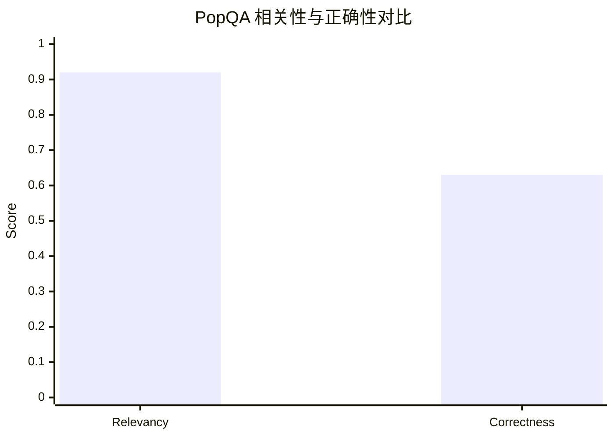
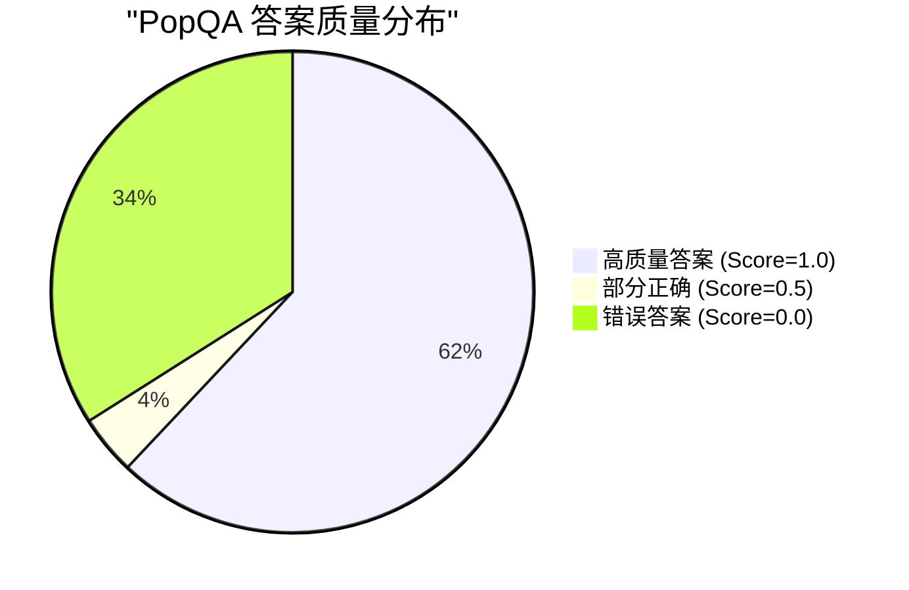
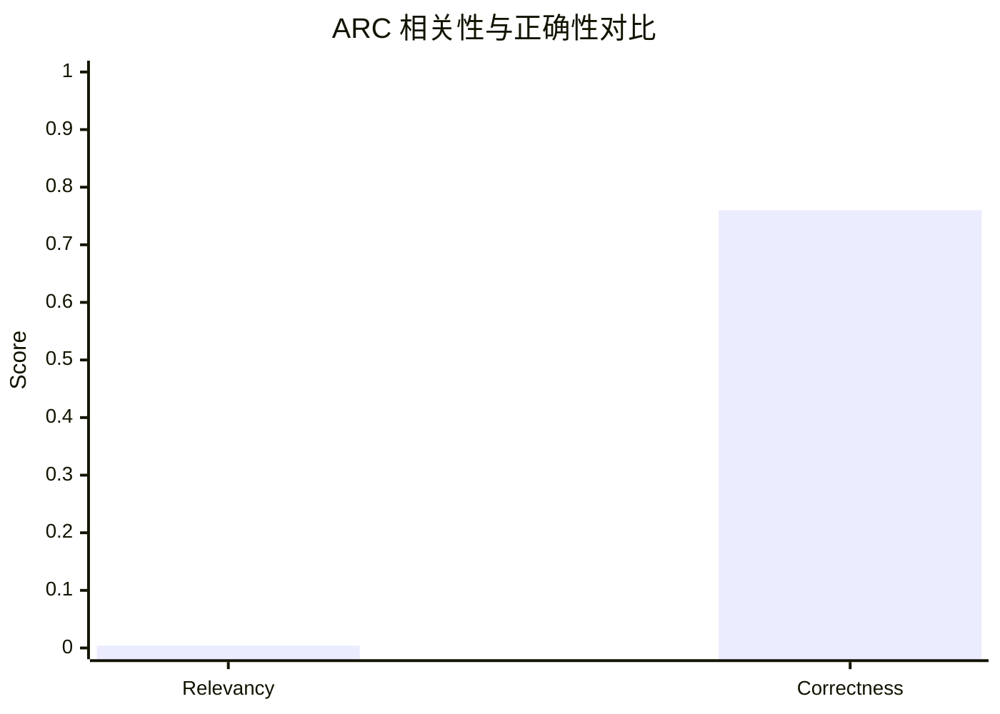
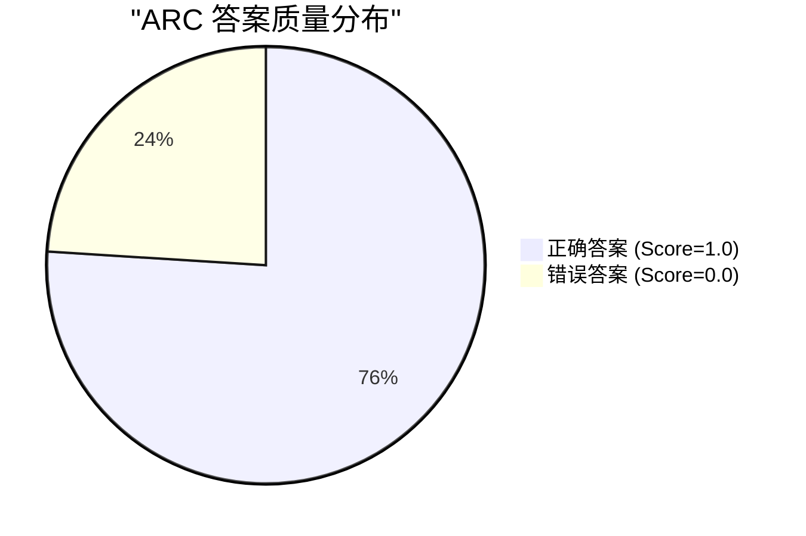
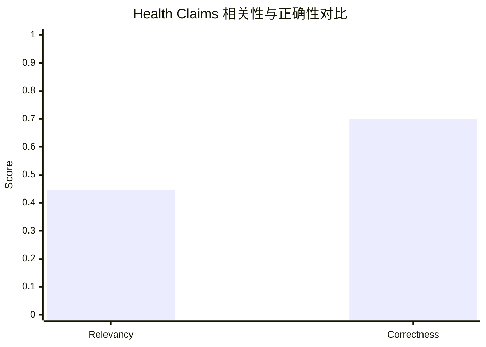
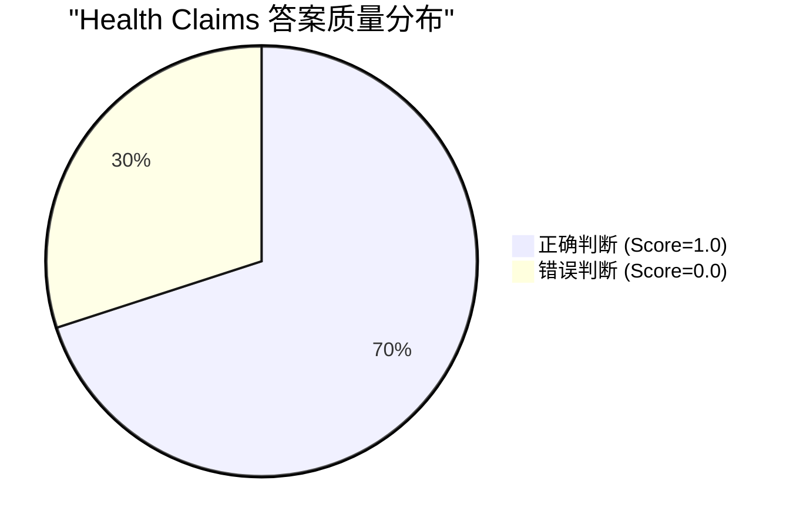
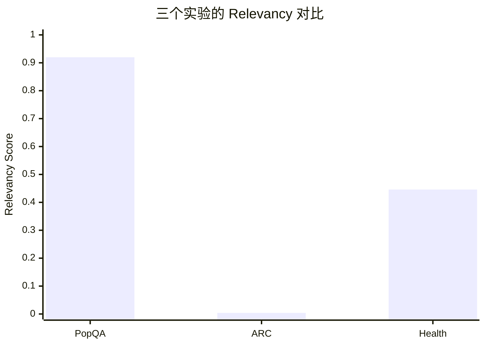
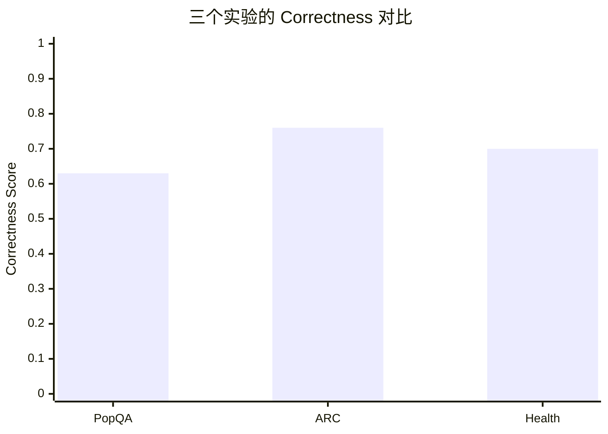
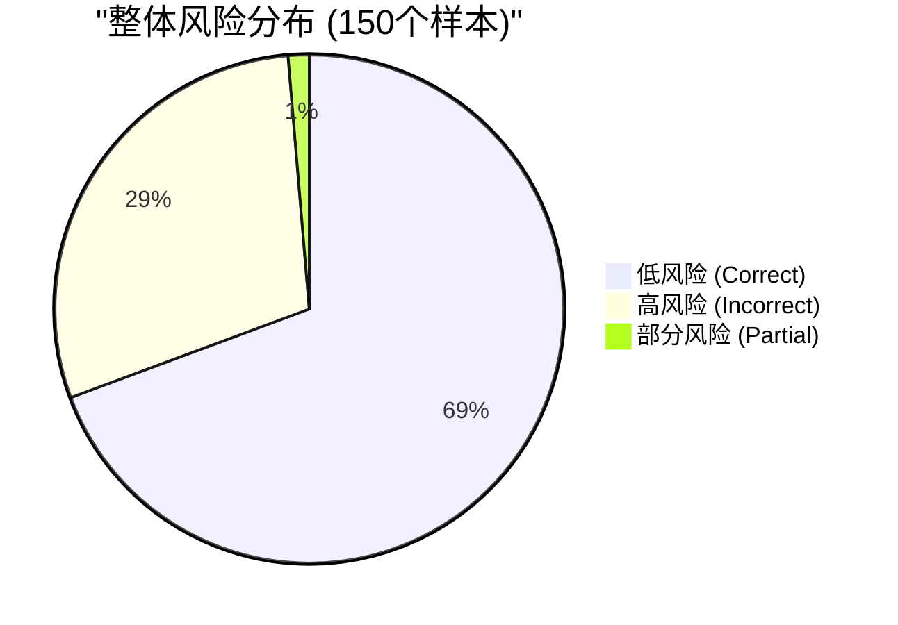

# Retrieval LM 实验结果总结

## 实验概览

本次实验对三个不同数据集进行了评估,分别是:
- **exp1**: PopQA (知识问答)
- **exp2**: ARC (科学推理)
- **exp3**: Health Claims (健康声明)

每个实验评估了50个样本,使用两个主要指标:
- **Relevancy (相关性)**: 检索内容与问题的相关程度
- **Correctness (正确性)**: 答案的准确性

---

## Experiment 1: PopQA (知识问答)

### 数据集说明
- **数据集**: PopQA Long-tail
- **样本数**: 50个样本 (索引 0-49)
- **任务类型**: 长尾知识问答

### 评估指标
| 指标 | 分数 |
|------|------|
| **Relevancy** | 0.92 (92%) |
| **Correctness** | 0.63 (63%) |

### 样例问题分析

**问题示例 1:**
- **问题**: "What is Henry Feilden's occupation?"
- **真实答案**: politician, political leader, political figure
- **模型表现**:
  - 相关性: 高 (能够检索到相关历史人物信息)
  - 正确性: 较好 (能够正确识别其政治家身份)

**问题示例 2:**
- **问题**: "What is Herlyn Espinal's occupation?"
- **真实答案**: journalist, journo, journalists
- **模型表现**:
  - 相关性: 高 (检索到详细的人物生平)
  - 正确性: 较好 (能识别记者身份)

### 幻觉分析

### 风险分析

### 关键发现
- ✅ **优势**: 检索相关性很高 (92%),说明系统能够找到与问题相关的知识
- ⚠️ **挑战**: 正确性相对较低 (63%),表明在提取精确答案时存在困难
- 📊 **模式**: 约62%的问题能完全正确回答,34%完全错误,4%部分正确

---

## Experiment 2: ARC (科学推理)

### 数据集说明
- **数据集**: AI2 Reasoning Challenge
- **样本数**: 50个样本 (索引 0-49)
- **任务类型**: 科学多项选择题

### 评估指标
| 指标 | 分数 |
|------|------|
| **Relevancy** | 0.004 (0.4%) |
| **Correctness** | 0.76 (76%) |

### 样例问题分析

**问题示例 1:**
- **问题**: "An astronomer observes that a planet rotates faster after a meteorite impact. Which is the most likely effect?"
- **真实答案**: C - "Planetary days will become shorter"
- **模型表现**:
  - 相关性: 极低 (检索内容可能不相关)
  - 正确性: 高 (尽管检索相关性低,但仍能推理出正确答案)

**问题示例 2:**
- **问题**: "What signals the beginning of photosynthesis?"
- **真实答案**: C - "Chlorophyll in the leaf captures light energy"
- **模型表现**:
  - 相关性: 极低
  - 正确性: 高 (正确选择)

### 幻觉分析

### 风险分析

### 关键发现
- 🔍 **异常现象**: 检索相关性极低 (0.4%),但正确性较高 (76%)
- 💡 **推测**: 模型可能主要依赖预训练知识而非检索内容来回答科学问题
- ⚠️ **风险**: 检索系统在科学推理任务上可能失效
- 📈 **准确率**: 76%的问题能正确回答,表现优于PopQA

---

## Experiment 3: Health Claims (健康声明验证)

### 数据集说明
- **数据集**: Health Claims Processed
- **样本数**: 50个样本 (索引 0-49)
- **任务类型**: 健康声明真假判断

### 评估指标
| 指标 | 分数 |
|------|------|
| **Relevancy** | 0.446 (44.6%) |
| **Correctness** | 0.70 (70%) |

### 样例声明分析

**声明示例 1:**
- **声明**: "A mother revealed to her child in a letter after her death that she had just one eye because she had donated the other to him."
- **标签**: REFUTES (虚假)
- **模型表现**:
  - 相关性: 中等 (能检索到部分相关信息)
  - 正确性: 良好 (能判断为虚假)

**声明示例 2:**
- **声明**: "Study says too many Americans still drink too much."
- **标签**: SUPPORTS (真实)
- **模型表现**:
  - 相关性: 中等
  - 正确性: 良好

**声明示例 3:**
- **声明**: "Viral image Says 80% of novel coronavirus cases are mild."
- **标签**: SUPPORTS (真实)
- **模型表现**:
  - 相关性: 较好
  - 正确性: 良好

### 幻觉分析

### 风险分析

### 关键发现
- 📊 **平衡表现**: 相关性 (44.6%) 和正确性 (70%) 处于中等水平
- 🎯 **适用性**: 检索对健康声明验证有一定帮助,但不是决定性因素
- ⚖️ **准确率**: 70%的判断正确率,表明模型在事实核查任务上有一定能力
- 🔄 **相关性分布**: 相关性分数分布较广 (0.0-1.0),说明检索质量不稳定

---

## 跨实验对比分析

### 性能对比图

### 综合评估表

| 实验 | 数据集类型 | Relevancy | Correctness | 相关性-正确性差值 |
|------|-----------|-----------|-------------|-----------------|
| **exp1** | PopQA | **0.92** 🥇 | 0.63 🥉 | +0.29 |
| **exp2** | ARC | 0.004 🥉 | **0.76** 🥇 | -0.756 |
| **exp3** | Health | 0.446 🥈 | 0.70 🥈 | -0.254 |

### 关键洞察

#### 1. 检索相关性与答案正确性的关系

- **PopQA**: 高相关性 → 中等正确性 (相关性有帮助但不充分)
- **ARC**: 低相关性 → 高正确性 (模型主要依赖内部知识)
- **Health**: 中等相关性 → 中等-高正确性 (检索起到辅助作用)

**结论**: 检索相关性与答案正确性并非线性正相关关系

#### 2. 任务类型影响分析

| 任务特征 | PopQA | ARC | Health |
|---------|-------|-----|--------|
| 知识密集度 | 高 | 中 | 中-高 |
| 推理需求 | 低 | 高 | 中 |
| 事实验证 | 是 | 否 | 是 |
| 最佳策略 | 检索为主 | 推理为主 | 检索+推理 |

#### 3. 幻觉风险评估

- **整体准确率**: 69.3% (104/150)
- **高风险案例**: 30.7% (46/150)

---

## 改进建议

### 针对 PopQA (知识问答)
1. ✅ **保持**: 高质量的检索系统
2. 🔧 **改进**: 答案提取和验证机制
3. 🎯 **重点**: 提高从高相关文档中提取精确答案的能力

### 针对 ARC (科学推理)
1. ⚠️ **问题**: 检索系统几乎失效
2. 🔍 **诊断**: 需要检查检索索引是否包含科学知识
3. 💡 **方案**:
   - 增强科学领域的检索语料
   - 考虑混合检索+生成策略
   - 优化查询重写针对科学问题

### 针对 Health Claims (健康声明)
1. 📈 **提升**: 检索相关性有较大提升空间
2. 🎯 **策略**:
   - 改进检索查询的构建方式
   - 增加医学领域的专业知识库
   - 实施多文档交叉验证机制

### 通用改进方向
1. **自适应策略**: 根据问题类型动态选择检索权重
2. **答案验证**: 增加答案一致性检查机制
3. **幻觉检测**: 开发专门的幻觉检测模块
4. **可解释性**: 提供答案来源和置信度信息

---

## 总结

### 主要发现
✅ 系统在知识问答任务中表现最稳定 (PopQA)
⚠️ 科学推理任务中检索系统未发挥作用 (ARC)
📊 健康声明验证任务表现平衡但有提升空间 (Health)

### 核心结论
**检索增强生成 (RAG) 的有效性高度依赖于任务类型和检索质量**

不同任务需要不同的优化策略,单一的检索方案无法适用所有场景。

---

*报告生成时间: 2025-11-05*
*数据来源: exp1_popqa_simple_eval.json, exp2_arc_simple_eval.json, exp3_health_simple_eval.json*
