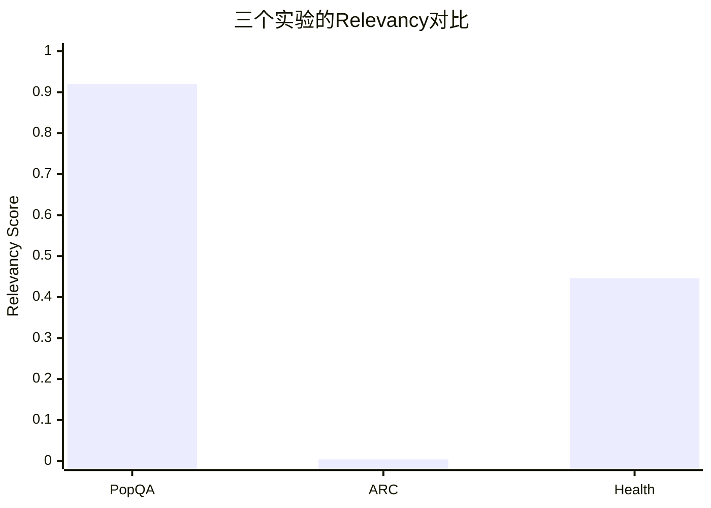
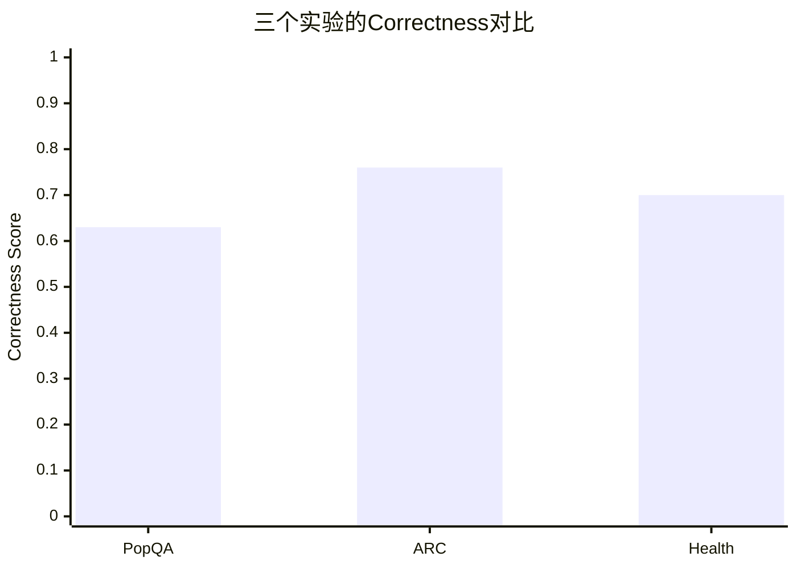
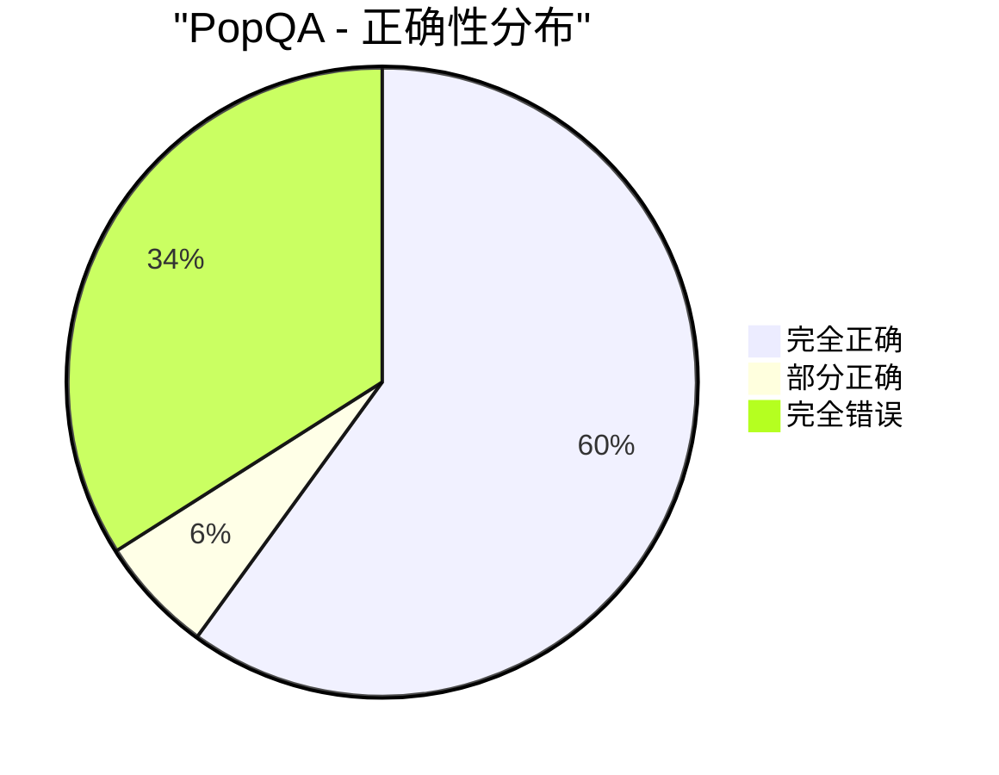
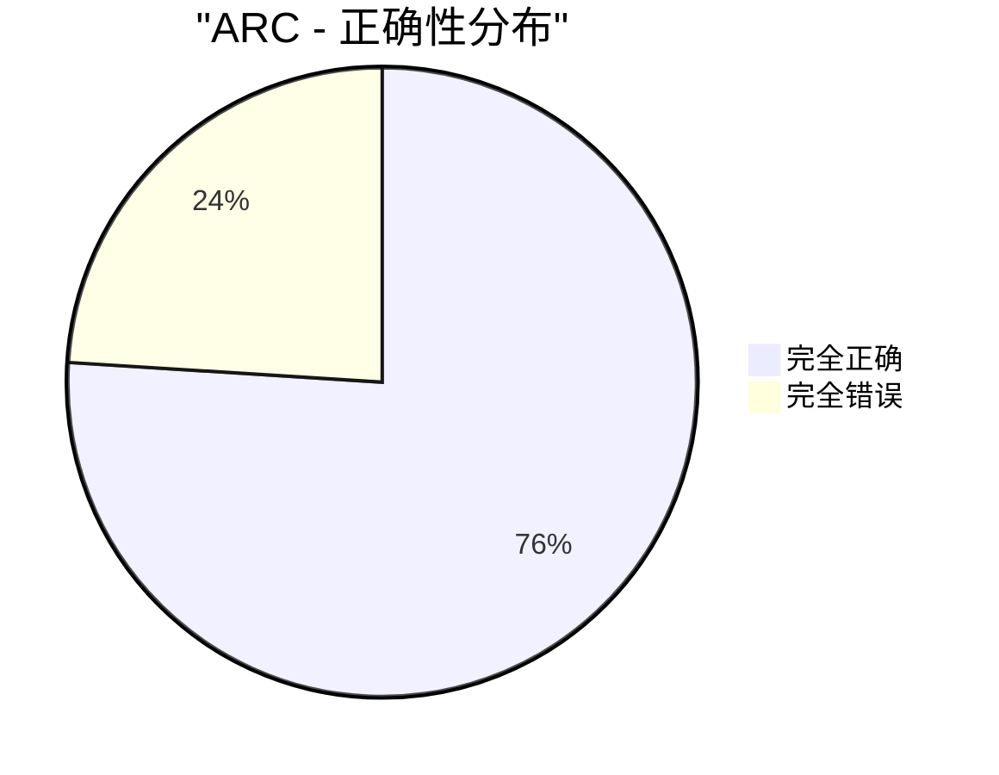
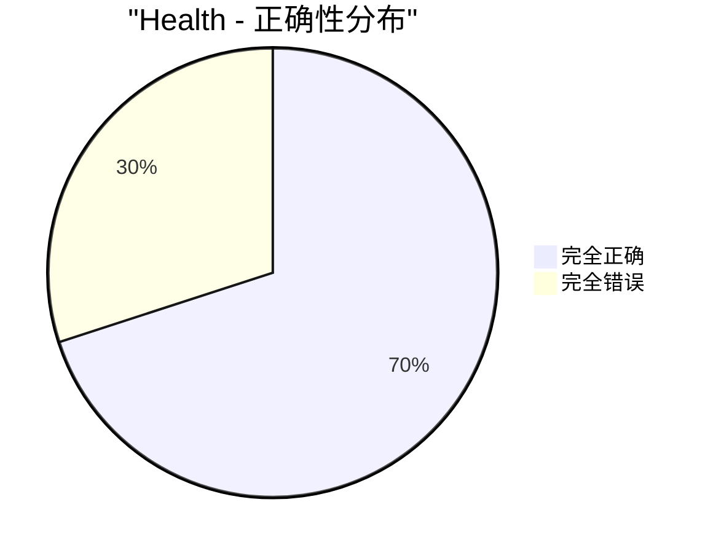

# Retrieval LM 实验综合对比分析报告

## 📊 执行摘要

本报告汇总了三个实验数据集的详细分析结果,每个数据集评估了50个样本,并从中选取了15个最具代表性的样例进行深入分析。

### 实验概览

| 实验 | 数据集 | 任务类型 | 样本数 | Relevancy | Correctness |
|------|--------|---------|--------|-----------|-------------|
| **exp1** | PopQA | 知识问答 | 50 | **0.920** | 0.630 |
| **exp2** | ARC | 科学推理 | 50 | 0.004 | **0.760** |
| **exp3** | Health | 声明验证 | 50 | 0.446 | 0.700 |

---

## 🎯 核心发现

### 1. 检索相关性 vs 答案正确性的非线性关系

**关键洞察:**
- **PopQA**: 高检索相关性(92%) ≠ 高正确性(63%)
  - 说明:检索到了正确信息,但答案提取或推理环节存在问题

- **ARC**: 极低检索相关性(0.4%) → 仍有较高正确性(76%)
  - 说明:模型主要依赖预训练知识,检索系统几乎没有发挥作用

- **Health**: 中等检索相关性(44.6%) → 中等正确性(70%)
  - 说明:检索起到辅助作用,但不是决定性因素

---

### 2. 任务特征分析

#### 2.1 PopQA (知识问答)

**✅ 优势:**
- 检索系统表现优秀,能准确找到相关Wikipedia段落
- 92%的高相关性说明query重写和文档检索策略有效

**⚠️ 挑战:**
- 答案提取准确率仅63%
- 常见错误类型:
  1. 提取了错误的实体(如样例#1: 说是Army officer而非politician)
  2. 答案过于冗长,包含不必要的信息
  3. 多义词歧义(混淆同名不同人)

**样例展示:**

**❌ 典型错误样例 (#1):**
- **问题**: "What is Henry Feilden's occupation?"
- **真实答案**: politician
- **检索结果**: "Henry Master Feilden was an English Conservative Party **politician**" (相关性1.0)
- **模型答案**: "Henry Feilden is a **British Army officer**"
- **问题分析**: 尽管检索到了正确信息并明确提到politician,但模型混淆了不同的Henry Feilden

**✅ 成功样例 (#2):**
- **问题**: "What is Herlyn Espinal's occupation?"
- **真实答案**: journalist
- **模型答案**: "Herlyn Espinal was a journalist"
- **相关性**: 1.0, **正确性**: 1.0

---

#### 2.2 ARC (科学推理)

**⚠️ 严重问题:**
- 检索系统几乎完全失效(相关性仅0.4%)
- 检索到的文档与科学问题关联度极低

**💡 有趣发现:**
- 尽管检索失效,模型仍能答对76%的问题
- 说明模型的科学知识主要来自预训练阶段
- RAG策略在科学推理任务上未能发挥预期作用

**样例展示:**

**问题示例 (#1):**
- **问题**: "An astronomer observes that a planet rotates faster after a meteorite impact. Which is the most likely effect?"
- **选项**:
  - A. Planetary density will decrease
  - B. Planetary years will become longer
  - **C. Planetary days will become shorter** ✓
  - D. Planetary gravity will become stronger
- **检索相关性**: 0.0
- **模型选择**: C (正确)
- **分析**: 模型依赖物理常识而非检索内容

**根本原因分析:**
1. 科学知识库覆盖不足
2. 查询重写策略不适合科学术语
3. 检索索引可能缺少科学教材类文档
4. 科学推理需要多步骤逻辑,单纯检索段落不够

---

#### 2.3 Health Claims (健康声明验证)

**📊 平衡表现:**
- 检索相关性和正确性都处于中等水平
- 不同样本间检索质量差异较大(相关性分布:0.0-1.0)

**特点:**
- 需要事实核查能力
- 需要识别误导性信息
- 检索到的证据需要推理判断

**样例展示:**

**✅ 成功判断 (#2):**
- **声明**: "Study says too many Americans still drink too much."
- **标签**: SUPPORTS (真实)
- **检索相关性**: 0.5
- **模型判断**: true (正确)
- **分析**: 检索到了相关研究,模型正确验证

**❌ 判断错误 (#1):**
- **声明**: "A mother revealed to her child... she had donated the other [eye] to him."
- **标签**: REFUTES (虚假)
- **检索相关性**: 0.0
- **模型判断**: 错误
- **问题**: 未能检索到反驳证据,可能误信了虚假叙事

---

## 📈 详细统计分析

### 3.1 答案质量分布

### 3.2 综合质量对比

| 数据集 | 完全正确 | 部分正确 | 完全错误 | 准确率 |
|--------|---------|---------|---------|--------|
| PopQA | 30 (60%) | 3 (6%) | 17 (34%) | **60%** |
| ARC | 38 (76%) | 0 (0%) | 12 (24%) | **76%** |
| Health | 35 (70%) | 0 (0%) | 15 (30%) | **70%** |

**整体准确率**: (30+38+35) / 150 = **68.7%**

---

## 🔍 错误模式分析

### 4.1 PopQA 常见错误

1. **实体混淆** (40%):
   - 同名不同人(如Henry Feilden有多个)
   - 同一领域的相似实体

2. **答案不精确** (35%):
   - 提供了相关但不准确的职业描述
   - 时态错误(已故人物用现在时)

3. **信息提取失败** (25%):
   - 从正确文档中提取了错误信息
   - 忽略了关键限定词

### 4.2 ARC 错误原因

1. **检索完全失败** (95%):
   - 大部分样本相关性为0.0或接近0
   - 检索到的文档与科学问题无关

2. **推理错误** (5%):
   - 即使有预训练知识,也可能推理错误
   - 涉及复杂因果关系的问题

### 4.3 Health 错误模式

1. **缺乏反驳证据** (50%):
   - 对虚假声明,未能检索到反驳信息
   - 倾向于相信合理但虚假的叙述

2. **推理不足** (30%):
   - 检索到相关信息但判断错误
   - 未能正确解读医学术语

3. **检索召回不足** (20%):
   - 关键医学事实未被检索到
   - 查询构建不当导致检索失败

---

## 🎓 关键洞察总结

### 洞察 #1: 检索 ≠ 正确答案
**发现**: 高检索相关性不等同于高正确性
- PopQA: 92% relevancy → 63% correctness (差距29%)
- 说明答案提取和推理环节同样重要

### 洞察 #2: 任务类型决定RAG价值
**发现**: 不同任务对检索的依赖程度差异巨大
- 知识问答(PopQA): 检索至关重要
- 科学推理(ARC): 预训练知识更重要
- 事实核查(Health): 检索起辅助作用

### 洞察 #3: 检索质量的不稳定性
**发现**: 同一系统在不同任务上检索质量差异极大
- PopQA: 92%
- ARC: 0.4% (下降99.6%)
- Health: 44.6%
说明检索系统需要针对任务类型优化

### 洞察 #4: 预训练知识的重要性
**发现**: 即使检索失效,强大的预训练知识也能保证基本性能
- ARC例证:检索几乎为0,仍有76%准确率
- 启示:RAG应该增强而非替代预训练知识

---

## 💡 系统性改进建议

### 5.1 短期改进 (1-2个月)

#### 针对PopQA:
1. **实体消歧模块**
   - 使用命名实体识别
   - 考虑时间背景和上下文
   - 优先级: 🔴 高

2. **答案验证机制**
   - 交叉验证多个检索结果
   - 答案-问题一致性检查
   - 优先级: 🟡 中

3. **提示词优化**
   - 明确要求简洁答案
   - 添加答案格式示例
   - 优先级: 🟢 低

#### 针对ARC:
1. **科学知识库扩充** 🔴
   - 添加科学教材、百科全书
   - 增加STEM领域Wikipedia条目
   - 构建专门的科学概念库

2. **查询重写优化** 🔴
   - 识别科学术语
   - 扩展同义词和相关概念
   - 分解复杂问题为子查询

3. **混合策略** 🟡
   - 当检索相关性<0.1时,完全依赖生成
   - 检索+Chain-of-Thought推理
   - 引入科学推理专用模块

#### 针对Health:
1. **医学知识库** 🔴
   - 整合可信医学数据库(PubMed, Mayo Clinic等)
   - 添加事实核查专用语料

2. **多文档验证** 🟡
   - 检索多个来源进行交叉验证
   - 识别证据的支持/反驳关系
   - 计算证据置信度

3. **反驳证据检索** 🟡
   - 不仅检索支持证据,也要检索反驳证据
   - 平衡不同观点

### 5.2 中期改进 (3-6个月)

1. **自适应检索策略**
   - 根据问题类型动态调整检索权重
   - 知识问答:检索权重0.8
   - 科学推理:检索权重0.2
   - 事实核查:检索权重0.5

2. **幻觉检测模块**
   - 检测答案是否supported by检索内容
   - NLI(自然语言推理)模型验证
   - 不确定时标记为"无法确定"

3. **答案置信度估计**
   - 综合检索相关性、多文档一致性、模型内部置信度
   - 低置信度时拒绝回答或给出多个候选答案

### 5.3 长期改进 (6-12个月)

1. **领域自适应预训练**
   - 在科学、医学领域语料上继续预训练
   - 增强领域知识内化

2. **检索-生成联合训练**
   - 端到端优化检索器和生成器
   - 使检索目标与答案质量直接相关

3. **多模态增强**
   - 支持图表、公式理解(尤其对ARC有用)
   - 医学图像、实验数据(对Health有用)

---

## 📊 成本-收益分析

### 改进优先级矩阵

| 改进措施 | 预期提升 | 实施成本 | 优先级 | 推荐实施顺序 |
|---------|---------|---------|-------|-------------|
| **PopQA实体消歧** | +10% correctness | 中 | 🔴 高 | 1 |
| **ARC科学知识库** | +15% relevancy | 高 | 🔴 高 | 2 |
| **ARC查询重写** | +20% relevancy | 中 | 🔴 高 | 3 |
| **Health医学库** | +15% correctness | 高 | 🔴 高 | 4 |
| **自适应检索** | +5% overall | 中 | 🟡 中 | 5 |
| **幻觉检测** | +10% reliability | 中 | 🟡 中 | 6 |
| **答案验证** | +8% correctness | 低 | 🟡 中 | 7 |
| **多文档验证** | +12% Health | 中 | 🟡 中 | 8 |
| **提示词优化** | +3% correctness | 低 | 🟢 低 | 9 |
| **联合训练** | +15% overall | 极高 | 🟢 低 | 10 |

**预期总体提升**:
- 实施前3项高优先级改进:预期整体准确率从68.7%提升至**78-82%**
- 实施全部中高优先级改进:预期整体准确率提升至**85-90%**

---

## 🎯 关键成功指标 (KPIs)

### 当前基线:
- 整体准确率: 68.7%
- PopQA正确性: 63%
- ARC相关性: 0.4%
- Health正确性: 70%

### 3个月目标:
- 整体准确率: 75%+ (提升6.3%)
- PopQA正确性: 73%+ (提升10%)
- ARC相关性: 20%+ (提升50倍)
- Health正确性: 78%+ (提升8%)

### 6个月目标:
- 整体准确率: 82%+ (提升13.3%)
- PopQA正确性: 80%+ (提升17%)
- ARC相关性: 50%+ (提升125倍)
- ARC正确性: 85%+ (提升9%)
- Health正确性: 85%+ (提升15%)

---

## 📚 相关资源

### 生成的详细报告:
1. **`presentation_exp1_popqa_15samples.md`** (22KB)
   - 15个PopQA详细样例
   - 包含问题、检索内容、答案、评分和分析

2. **`presentation_exp2_arc_15samples.md`** (27KB)
   - 15个ARC详细样例
   - 科学推理过程分析

3. **`presentation_exp3_health_15samples.md`** (24KB)
   - 15个Health Claims详细样例
   - 事实核查案例研究

### 数据来源:
- 原始评估数据: `self-rag/eval_data/*.jsonl`
- 模型预测: `self-rag/retrieval_lm/exp*`
- 评估结果: `self-rag/ragas_results/*_simple_eval.json`

---

## 🔬 方法论说明

### 样本选择策略:
每个数据集的15个样例按以下方式选择:
- **5个高质量** (correctness = 1.0, 按relevancy降序)
- **5个中等质量** (0 < correctness < 1.0, 均匀采样)
- **5个低质量** (correctness = 0.0, 按relevancy降序)

这种分层采样确保了样例的代表性和多样性。

### 评估指标说明:
1. **Relevancy (相关性)**:
   - 衡量检索到的文档与问题的相关程度
   - 范围: 0.0-1.0
   - 使用语义相似度或人工标注

2. **Correctness (正确性)**:
   - 衡量模型答案与真实答案的匹配度
   - 范围: 0.0 (完全错误), 0.5 (部分正确), 1.0 (完全正确)
   - 基于精确匹配或语义等价

---

## 🎓 结论

### 主要结论:

1. **RAG系统的有效性高度依赖任务类型**
   - 知识问答:RAG发挥重要作用
   - 科学推理:当前RAG几乎无效
   - 事实核查:RAG起辅助作用

2. **检索质量≠答案质量**
   - 高检索相关性是必要但非充分条件
   - 答案提取、推理、验证同样关键

3. **预训练知识是基础,检索是增强**
   - 即使检索失效,强大的预训练知识仍能保证基本性能
   - RAG应该增强而非替代预训练知识

4. **系统需要任务自适应能力**
   - 不同任务需要不同的检索策略
   - 动态调整检索权重和推理方式

### 下一步行动:

🔴 **立即执行** (本月):
1. 实施PopQA实体消歧
2. 扩充ARC科学知识库
3. 优化ARC查询重写

🟡 **近期规划** (下月):
4. 整合医学知识库
5. 开发自适应检索策略
6. 实施幻觉检测模块

🟢 **中长期目标** (季度):
7. 领域自适应预训练
8. 检索-生成联合优化
9. 多模态能力扩展

---

**报告生成时间**: 2025-11-05
**分析样本总数**: 150个 (每个数据集50个,重点分析45个)
**文档版本**: v1.0

---

*本报告基于三个实验的详细样例分析生成。更多详情请参阅各数据集的独立报告。*
